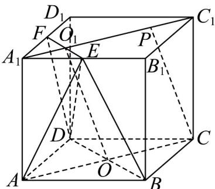

> [!faq]- 《专题05_线面位置关系的四大常考题型_高效培优专项训练_》官方解析
>
> > [!success]- **【答案】** (1) $\frac{7}{24}$ (2) $\frac{\sqrt{2}}{4}$
>
> > [!note]- **【分析】**
> > （1）将五面体 $ABD - A_{1}EF$ 拆成三棱锥 $E - ABD$ 和四棱锥 $E - A_{1}ADF$ ，根据正方体的结构特征，以及锥体的体积公式，即可求解；
> >
> > (2) 设 $BD \cap AC = O$ ， $EF \cap A_1C_1 = O_1$ ，证得 $CP // OO_1$ ，在矩形 $ACC_1A_1$ 中，求得 $CO, A_1O_1$ 的长，根据 $CP // OO_1$ ，得到 $OO_1PC$ 为平行四边形，结合 $C_1P = C_1A_1 - A_1O_1 - O_1P$ .
>
> > [!note]- **【解析】**
> > （1）解：如图所示，将五面体 $ABD - A_{1}EF$ 拆成三棱锥 $E - ABD$ 和四棱锥 $E - A_{1}ADF$
> >
> > 在三棱锥 $E - ABD$ 中，可得 $S_{\triangle ABD} = \frac{1}{2}\times 1\times 1 = \frac{1}{2}$
> >
> > 又由正方体 $ABCD-A_{1}B_{1}C_{1}D_{1}$ 中， $AA_{1}\perp$ 平面 ABCD ， $A_{1}B_{1}//AB$ ，且 E 为 $A_{1}B_{1}$ 的中点，
> >
> > 所以 E 到平面 ABCD 的距离等于 $A_{1}$ 到平面 ABCD 的距离，即三棱锥的高为 1，
> >
> > 在四棱锥 $E-A_{1}ADF$ 中，可得 $S_{A_{1}ADF}=\frac{1}{2}\times(1+\frac{1}{2})\times1=\frac{3}{4}$
> >
> > 又由正方体 $ABCD - A_{1}B_{1}C_{1}D_{1}$ 中， $A_{1}B_{1} \perp$ 平面 $ADD_{1}A_{1}$ ，且 $E$ 为 $A_{1}B_{1}$ 的中点，
> >
> > 所以 $E$ 到平面 $ADD_{1}A_{1}$ 的距离等于为 $\frac{1}{2}$ ，即四棱锥 $E - A_{1}ADF$ 的高为 $\frac{1}{2}$ ，
> >
> > 所以五面体 $ABD - A_{1}EF$ 的体积 $V = \frac{1}{3} \times \frac{1}{2} \times 1 + \frac{1}{3} \times \frac{3}{4} \times \frac{1}{2} = \frac{7}{24}$ .
> >
> > (2) 解：设 $BD \cap AC = O$ ， $EF \cap A_1C_1 = O_1$ ，则平面 $ACC_1A_1 \cap$ 平面 $BDFE = OO_1$
> >
> > 又因为 $CP / /$ 平面 $BDFE$ ，且 $CP \subset$ 平面 $ACC_{1}A_{1}$ ，所以 $CP / / OO_{1}$
> >
> > 在矩形 $ACC_{1}A_{1}$ 中，由 $AA_{1} = 1, AC = \sqrt{2}$ ，可得 $CO = \frac{\sqrt{2}}{2}, A_{1}O_{1} = \frac{\sqrt{2}}{4}$ ，
> >
> > 又因为 $CP / / OO_{1}$ ，所以四边形 $OO_{1}PC$ 为平行四边形，所以 $O_{1}P = CO = \frac{\sqrt{2}}{2}$
> >
> > 所以 $C_1P = C_1A_1 - A_1O_1 - O_1P = \sqrt{2} -\frac{\sqrt{2}}{4} -\frac{\sqrt{2}}{2} = \frac{\sqrt{2}}{4}.$
> >
> > 
> >
> > 题型二：面面平行考点
