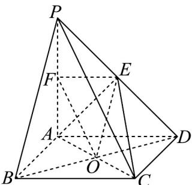

> [!faq]- 《专题05_线面位置关系的四大常考题型_高效培优专项训练_》官方解析
>
> > [!success]- **【答案】** 存在，F 为 PA 中点，证明见解析
>
> > [!note]- **【分析】**
> > 分析，当 F 为 PA 中点时，由线面平行判定定理得 $EF \parallel$ 平面 PBC， $OE \parallel$ 平面 PBC，再结合面面平行判定定理求证即可得结论.
>
> > [!note]- **【解析】**
> > 存在，F 为 PA 中点时，平面 OEF// 平面 PBC，
> >
> > 连接 BD，设 $AC \cap BD = O$ ，连接 OE，易知 $OE // PB$
> >
> > 
> >
> > 因为 $F$ 为 $PA$ 中点， $E$ 为 $PD$ 的中点，所以 $EF \parallel AD$
> >
> > 由于 $BC \parallel AD$ ，所以 $EF \parallel BC$
> >
> > 由于 $EF \not\subset$ 平面 PBC， $BC \subset$ 平面 PBC，
> >
> > 所以 $EF \parallel$ 平面 PBC ，
> >
> > 同理可证得 $OE \parallel$ 平面 $PBC$ ，
> >
> > 由于 $OE \cap EF = E$ ， $OE, EF \subset$ 平面 OEF，
> >
> > 所以平面 OEF// 平面 PBC .
