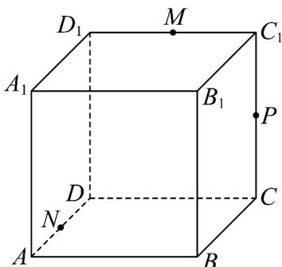
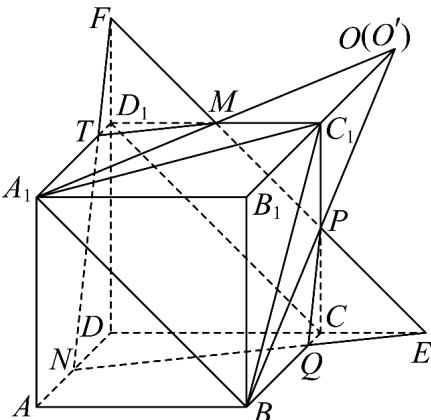

> [!faq]- 《专题05_线面位置关系的四大常考题型_高效培优专项训练_》官方解析
>
> > [!success]- **【答案】**  A. 直线 $MP \parallel$ 平面 $A_{1}BC_{1}$ B. 平面 $MPN \parallel$ 平面 $A_{1}BC_{1}$ C．直线 $A_{1}M$ 、 BP 、 $B_{1}C_{1}$ 三线共点 D．过 M, N, P 三点作正方体的截面，截面的周长为 $\sqrt{2} + 2\sqrt{10}$
>
> > [!note]- **【分析】**
> > 利用线面平行的判定推理判断 A；作出过点 M, N, P 的正方体的截面，计算判断 BD；借助三角形中位线性质判断 C.
>
> > [!note]- **【解析】**
> > 在棱长为2的正方体 $ABCD - A_{1}B_{1}C_{1}D_{1}$ 中，点 $M, P, N$ 分别是棱 $C_{1}D_{1}, CC_{1}, AD$ 的中点，
> >
> > 对于 A，连接 $CD_{1}$ ， $MP//CD_{1}//A_{1}B$ ， $MP\notin$ 平面 $A_{1}BC_{1}$ ， $A_{1}B\subset$ 平面 $A_{1}BC_{1}$ ，则 $MP//$ 平面 $A_{1}BC_{1}$ ，A 正确；
> > 对于 B，直线 MP 与 $DC, DD_{1}$ 的延长线交于点 E, F，连接 NE, NF 与 $BC, A_{1}D_{1}$ 分别交于点 Q, T，
> >
> > 由 $C_1M // CE$ ，得 $\frac{CE}{C_1M} = \frac{CP}{C_1P} = 1$ ，则 $CE = C_1M = 1$ ，由 $CQ // AD$ ，得 $\frac{CQ}{ND} = \frac{CE}{DE} = \frac{1}{3}$
> >
> > $\frac{CQ}{BC} = \frac{1}{6}$ ，则直线 $PQ$ 与 $BC_{1}$ 不平行，而 $PQ, BC_{1} \subset$ 平面 $BCC_{1}B_{1}$ ，于是 $PQ$ 与 $BC_{1}$ 必相交，
> >
> > 又 $PQ \subset$ 平面 MPN ， $BC_{1} \subset$ 平面 $A_{1}BC_{1}$ ，即平面 MPN 与平面 $A_{1}BC_{1}$ 有公共点，B 错误；
> >
> > 
> >
> > 对于 C，由 $C_{1}M // A_{1}B_{1}, A_{1}B_{1} = 2C_{1}M$ ，令直线 $A_{1}M \cap B_{1}C_{1} = O$ ，则 $C_{1}$ 是 $B_{1}O$ 的中点，
> >
> > 同理直线 $BP \cap B_{1}C_{1} = O^{\prime}$ ， $C_{1}$ 是 $B_{1}O^{\prime}$ 的中点，因此 $O^{\prime}, O$ 重合，C 正确；
> >
> > 对于D，由选项B知，五边形MPQNT是过 $M,N,P$ 三点的正方体截面，
> >
> > $\frac{PQ}{NF} = \frac{QE}{NE}$ ，而 $NF = NE = \sqrt{10}$ ，则 $PQ = QE$ ，同理 $MT = TF$
> >
> > 因此五边形 MPQNT 周长等于 $2NE + MP = 2\sqrt{10} + \sqrt{2}$ ，D 正确.
> >
> > 故选 **ACD**
