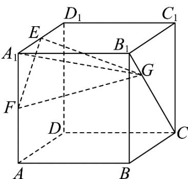
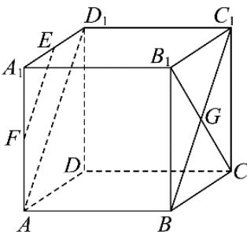
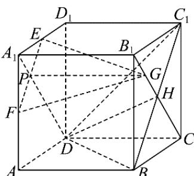
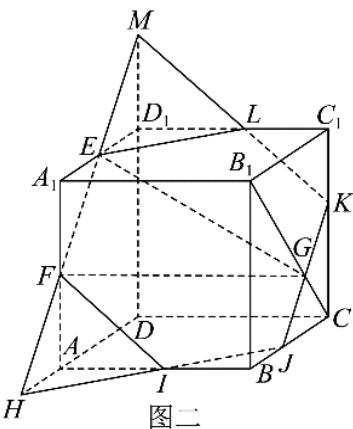

> [!faq]- 《专题05_线面位置关系的四大常考题型_高效培优专项训练_》官方解析
>
> > [!success]- **【答案】**  A. 存在点 $G$ ，使 $BG // EF$ B．存在点G，使平面 $EFG//$ 平面 $BDC_{1}$ C．三棱锥 $A_{1}-EFG$ 的体积为定值 D．存在点 G，使得平面 EFG 截正方体所得截面为正六边形
>
> > [!note]- **【分析】**
> > 对于 A 项，取点 G 为 $B_{1}C$ 与 $BC_{1}$ 的交点，可证明 $BG // EF$ 即可判断 A 项；对于 B 项，若平面
> >
> > $EFG //$ 平面 $BDC_{1}$ ，即可得出 $PD = GH$ 且 $PD // GH$ ，而 $PD > \frac{\sqrt{2}}{2} = B_{1}H$ ，故 $G$ 应在 $CB_{1}$ 延长线上，即可判断 B 项；对于 C 项， $G$ 移动但 $G$ 到面 $A_{1}EF$ 的距离始终不变即可判断 C 项；对于 D 项， $G$ 为 $B_{1}C$ 靠近 C 的四等分点时画出截面图，由图可可判断 D 项.
>
> > [!note]- **【解析】**
> > 对于 A 项，存在点 G 为 $B_{1}C$ 与 $BC_{1}$ 的交点，使得 $BG // EF$ ，理由如下：
> >
> > 若点 G 为 $B_{1}C$ 与 $BC_{1}$ 的交点，则 $B, G, C_{1}$ 三点共线，
> >
> > 由正方体性质得， $AB / / C_1D_1,AB = C_1D_1$ ，所以四边形 $ABC_{1}D_{1}$ 是平行四边形，所以 $BC_{1} / / AD_{1}$
> >
> > 因为 E, F 为 $A_{1}D_{1}, AA_{1}$ 中点，所以 $EF \parallel AD_{1}$ ，所以 $BC_{1} \parallel EF$ ，即 $BG \parallel EF$ ，A 正确；
> >
> > 
> >
> > 对于 B 项，如图，连接 $A_{1}D \cap EF = P$ ，H 为侧面 $CB_{1}$ 中心，
> >
> > 则平面 $A_{1}DCB_{1}$ 与平面 EFG 和平面 $BDC_{1}$ 分别交于线 PG, DH
> >
> > 若存在 G 点使平面 $EFG \parallel$ 平面 $BDC_{1}$ ，则 $PG \parallel DH$ ，又 $A_{1}D \parallel CB_{1}$ ，则四边形 PGHD 为平行四边形，
> >
> > 即 $PD = GH$ ， $PD > \frac{\sqrt{2}}{2} = B_1H$ ，此时 $G$ 应在 $CB_{1}$ 延长线上，B错误；
> >
> > 
> >
> > 对于 C 项，易知 $B_{1}C //$ 平面 $A_{1}EF$ ，随着 G 移动但 G 到平面 $A_{1}EF$ 的距离始终不变，即为 $A_{1}B_{1}$ ，故 $V_{A_{1}-EFG} = V_{G-A_{1}EF} = \frac{1}{3} \times A_{1}B_{1} \times S_{\triangle A_{1}EF} = \frac{1}{24}$ 是定值，C 正确；
> >
> > 对于 D 项，如图，当 G 为 $B_{1}C$ 靠近 C 的四等分点时，
> >
> > 平面 EFG 截正方体的截面为正六边形，D 正确
> >
> > 
> >
> > 故选 **ACD**
