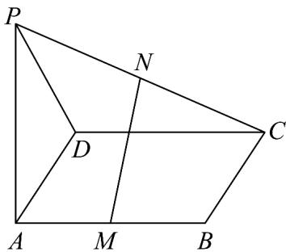

<!-- question-source:start -->
21．如图， $PA \perp$ 矩形 ABCD 所在的平面，M,N 分别是 AB,PC 的中点.

(1)求证： $MN / /$ 平面PAD；

(2)若 $PD$ 与平面 $ABCD$ 所成的角为 $\alpha$ ，当 $\alpha$ 为多少度时， $MN \perp$ 平面 $PCD$ ?
<!-- question-source:end -->

![[高中/课堂同步/题库/人教A版高中数学同步讲义(2026)/02_必修第二册/第八章 立体几何初步/专项训练/专题05_线面位置关系的四大常考题型_高效培优专项训练_/题型三_sec_03/questions/answers/Q00065131A1.md]]
