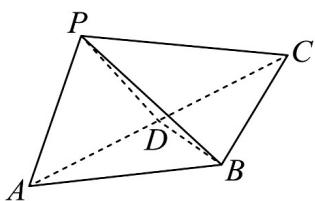

<!-- question-source:start -->
24. 在 $\mathrm{V}ABC$ 中， $AB = BC = 2$ ， $\angle ABC = 120^{\circ}$ 。若平面 $ABC$ 外的点 $P$ 和线段 $AC$ 上的点 $D$ ，满足 $PD = DA$ ， $PB = BA$ ，四面体 $P - ABC$ 的体积为 $\frac{\sqrt{21}}{6}$ 。

(1)证明： $BD \perp AP$ ；

(2)求直线 PB 与平面 ABC 所成角的正弦值.
<!-- question-source:end -->

![[高中/课堂同步/题库/人教A版高中数学同步讲义(2026)/02_必修第二册/第八章 立体几何初步/专项训练/专题05_线面位置关系的四大常考题型_高效培优专项训练_/题型三_sec_03/questions/answers/Q00065134A1.md]]
