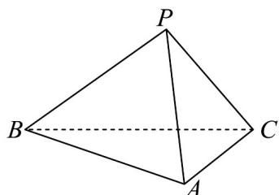

<!-- question-source:start -->
29. 如图，三棱锥 $P - ABC$ 中， $\mathrm{V}ABC$ 为等边三角形， $PB \perp PC$ ， $PB = PC$ ，点 $P$ 到平面 $ABC$ 的距离为 2.

(1)求点 A 到平面 PBC 的距离；

(2)若 $BC = 4\sqrt{2}$ ，求 $PC$ 与平面 $ABC$ 所成角的正弦值.
<!-- question-source:end -->

![[高中/课堂同步/题库/人教A版高中数学同步讲义(2026)/02_必修第二册/第八章 立体几何初步/专项训练/专题05_线面位置关系的四大常考题型_高效培优专项训练_/题型三_sec_03/questions/answers/Q00065139A1.md]]
