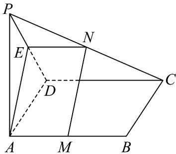

> [!faq]- 《专题05_线面位置关系的四大常考题型_高效培优专项训练_》官方解析
>
> > [!success]- **【答案】** (1)证明见解析 (2) $\frac{\pi}{4}$
>
> > [!note]- **【分析】**
> > （1）取 $PD$ 的中点 $E$ ，连接 $NE, AE$ ，利用几何关系得 $MN // AE$ ，再利用线面平行的判定，即可求解；
> >
> > (2) 利用线面角的定义，知 $\angle PDA$ 即为 $PD$ 与平面 $ABCD$ 所成的角，从而 $\alpha = 45^{\circ}$ 时， $AE \perp PD$ ，进而可得 $MN \perp PD$ ，再由线面垂直的性质和线面垂直的判定得 $CD \perp MN$ ，再由线面垂直的判定，即可求解.
>
> > [!note]- **【解析】**
> > （1）取 $PD$ 的中点 $E$ ，连接 $NE, AE$ ，如图，
> >
> > 因为 $N$ 是 $PC$ 的中点，所以 $NE // DC$ 且 $NE = \frac{1}{2} DC$
> >
> > 又因为 $DC / / AB$ 且 $DC = AB$ ， $AM = \frac{1}{2} AB$
> >
> > 所以 AM // CD 且 $AM = \frac{1}{2} CD$ ，所以 NE // AM，且 NE = AM，
> >
> > 所以四边形 AMNE 是平行四边形，则 MN // AE
> >
> > 又 $AE \subset$ 平面 $PAD$ ， $MN \notin$ 平面 $PAD$ ，所以 $MN //$ 平面 $PAD$ .
> >
> > 
> >
> > (2) $\alpha = 45^{\circ}$ 时， $MN \perp$ 平面 $PCD$ ，证明如下，因为 $PA \perp$ 平面 $ABCD$ ，所以 $\angle PDA$ 即为 $PD$ 与平面 $ABCD$ 所成的角，当 $\angle PDA = 45^{\circ}$ 时，则 $AP = AD$ ，所以 $AE \perp PD$ ，又由 (1) 知 $MN // AE$ ，所以 $MN \perp PD$ ，因为 $PA \perp$ 平面 $ABCD$ ， $CD \subset$ 平面 $ABCD$ ，所以 $PA \perp CD$ ，又 $\because CD \perp AD$ ， $PA \cap AD = A$ ， $PA, AD \subset$ 平面 $PAD$ ， $\therefore CD \perp$ 平面 $PAD$ ， $\because AE \subset$ 平面 $PAD$ ， $\therefore CD \perp AE$ ， $\therefore CD \perp MN$ ，又 $CD \cap PD = D, CD, PD \subset$ 平面 $PCD$ ，所以 $MN \perp$ 平面 $PCD$ .
