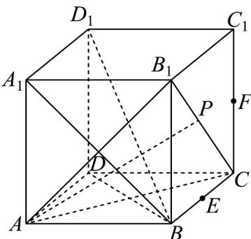
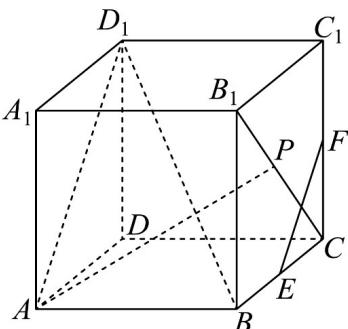
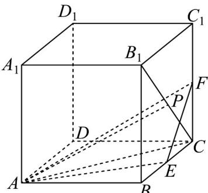
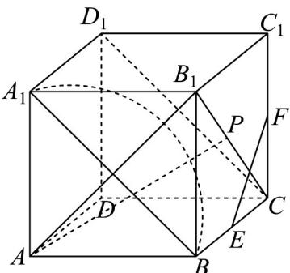

> [!faq]- 《专题05_线面位置关系的四大常考题型_高效培优专项训练_》官方解析
>
> > [!success]- **【答案】** A. $AP$ 与 $BD_{1}$ 始终保持垂直 B. $EF$ 与 $BD_{1}$ 所成角的正弦值为 $\frac{\sqrt{6}}{3}$ C. 点 $C$ 到平面 $AEF$ 的距离为 $\frac{1}{3}$ D. 以 $A$ 为球心， $AB$ 为半径的球面与四边形 $A_{1}BCD_{1}$ 的交线长为 $\frac{\sqrt{2}\pi}{2}$
>
> > [!note]- **【分析】**
> > 对于 A，根据正方体的性质以及线面垂直的判定与性质，可得其正误；对于 B，根据异面直线的夹角以及正方体的性质，利用锐角三角函数，可得其正误；对于 C，利用等体积法，根据三棱锥的体积公式以及三角形的面积的公式，可得其正误；对于 D，根据球与正方体的性质，可得交线的轨迹，利用圆锥的性质，可得其正误.
>
> > [!note]- **【解析】**
> > 对于 A，由题意可作图如下：
> >
> > 
> >
> > 在正方体 $ABCD - A_{1}B_{1}C_{1}D_{1}$ 中，易知 $A_{1}B \perp AB_{1}$ ， $A_{1}D_{1} \perp$ 平面 $ABB_{1}A_{1}$
> >
> > 因为 $AB_{1} \subset$ 平面 $ABB_{1}A_{1}$ ，所以 $A_{1}D_{1} \perp AB_{1}$
> >
> > 因为 $A_{1}D_{1}\cap A_{1}B = A_{1}$ ， $A_{1}D_{1},A_{1}B\subset$ 平面 $A_{1}BD_{1}$ ，所以 $AB_{1}\bot$ 平面 $A_{1}BD_{1}$
> >
> > 因为 $BD_{1} \subset$ 平面 $A_{1}BD_{1}$ ，所以 $AB_{1} \perp BD_{1}$ ，同理可得 $AC \perp BD_{1}$
> >
> > 因为 $AC \cap AB_{1} = A$ ， $AC, AB_{1} \subset$ 平面 $AB_{1}C$ ，所以 $BD_{1} \perp$ 平面 $AB_{1}C$
> >
> > 因为 $AP \subset$ 平面 $AB_{1}C$ ，所以 $BD_{1} \perp AP$ ，故 A 正确；
> >
> > 对于 B，由题意可作图如下：
> >
> > 
> >
> > 因为 $E, F$ 分别为 $BC, CC_{1}$ 的中点，所以在正方体 $ABCD - A_{1}B_{1}C_{1}D_{1}$ 中， $EF \parallel AD_{1}$
> >
> > 在 $\mathrm{Rt}\triangle A_1AD_1$ 中， $AD_{1} = \sqrt{A_{1}D_{1}^{2} + AA_{1}^{2}} = \sqrt{2}$
> >
> > 在正方体 $ABCD - A_{1}B_{1}C_{1}D_{1}$ 中，易知 $AB \perp$ 平面 $ADD_{1}A_{1}$
> >
> > 因为 $AD_{1} \subset$ 平面 $ADD_{1}A_{1}$ ，所以 $AB \perp AD_{1}$
> >
> > 在 $\mathrm{Rt}\triangle ABD_{1}$ 中， $BD_{1} = \sqrt{AD_{1}^{2} + AB^{2}} = \sqrt{3}$ ，则 $\sin \angle AD_1B = \frac{AB}{BD_1} = \frac{\sqrt{3}}{3}$
> >
> > 所以 $EF$ 与 $BD_{1}$ 所成角的正弦值为 $\frac{\sqrt{3}}{3}$ ，故B错误；
> >
> > 对于 C，由题意可作图如下：
> >
> > 
> >
> > 在正方体 $ABCD-A_{1}B_{1}C_{1}D_{1}$ 中，易知 $CC_{1}\perp$ 平面 ABCD
> >
> > 所以三棱锥 $F - ACE$ 的体积 $V = \frac{1}{3} \cdot CF \cdot S_{\triangle ACE} = \frac{1}{3} \cdot CF \cdot \frac{1}{2} \cdot AB \cdot CE = \frac{1}{24}$
> >
> > 因为 $AC \subset$ 平面 $ABCD$ ，所以 $CF \perp AC$ ，则 $AF = \sqrt{AC^2 + CF^2} = \frac{3}{2}$ ，
> >
> > 易知 $AE = \sqrt{AB^{2} + BE^{2}} = \frac{\sqrt{5}}{2}$ ， $EF = \frac{1}{2}\sqrt{BC^{2} + CC_{1}^{2}} = \frac{\sqrt{2}}{2}$ ，
> >
> > 在 $\triangle AEF$ 中， $\cos \angle AEF = \frac{AE^2 + EF^2 - AF^2}{2 \cdot AE \cdot EF} = -\frac{\sqrt{10}}{10}$ ，
> >
> > 则 $\sin \angle AEF = \sqrt{1 - \cos^2\angle AEF} = \frac{3\sqrt{10}}{10}$ ，所以 $S_{\triangle AEF} = \frac{1}{2}\cdot AE\cdot EF\cdot \sin \angle AEF = \frac{3}{8}$
> >
> > 即点 $C$ 到平面 $AEF$ 的距离 $d = \frac{3V}{S_{\triangle AEF}} = \frac{1}{3}$ ，故C正确；
> >
> > 对于 D，由题意可作图如下：
> >
> > 
> >
> > 在正方体 $ABCD - A_{1}B_{1}C_{1}D_{1}$ 中，易知 $AB_{1} \perp A_{1}B$ ， $BC \perp$ 平面 $ABB_{1}A_{1}$
> >
> > 因为 $AB_{1} \subset$ 平面 $ABB_{1}A_{1}$ ，所以 $BC \perp AB_{1}$
> >
> > 因为 $A_{1}B \mid B C = B$ ， $A_{1}B, BC \subset$ 平面 $A_{1}BCD_{1}$ ，所以 $AB_{1} \perp$ 平面 $A_{1}BCD_{1}$
> >
> > 由题意可得交线为圆锥底面周长的一半，圆锥的顶点为 $A$ ，底面直径为 $A_{1}B = \sqrt{2}$
> >
> > 则交线的长度为 $\frac{1}{2} \cdot \pi \cdot A_{1}B = \frac{\sqrt{2}\pi}{2}$ ，故 D 正确.
> >
> > 故选 **ACD**.
