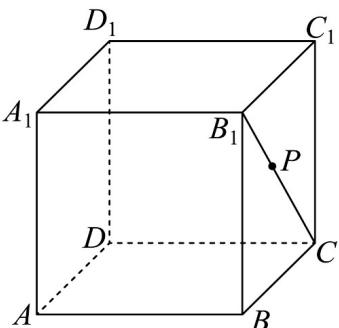
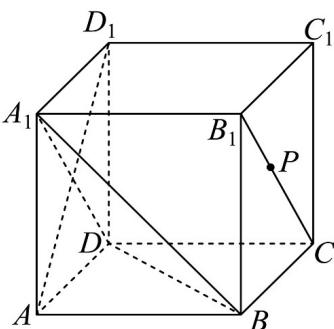
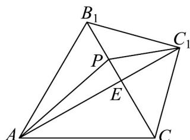

> [!faq]- 《专题05_线面位置关系的四大常考题型_高效培优专项训练_》官方解析
>
> > [!success]- **【答案】**  A. 三棱锥 $P - A_{1}BD$ 的体积为定值 B． $AD_{1}$ 与平面 $PA_{1}D$ 所成角的正弦值随着点 P 从 $B_{1}$ 移动到 C 越来越大 C. $C_1P + AP$ 的最小值为 $\sqrt{6} +\sqrt{2}$ D．当点P为 $B_{1}C$ 的中点时，过点P作正方体外接球的截面，所得截面面积的最小值为 $2\pi$
>
> > [!note]- **【分析】**
> > 证得 $B_{1}C / /$ 平面 $A_{1}BD$ 并结合锥体体积判断A；证得 $AD_{1} \perp$ 平面 $PA_{1}D$ 判断B；利用两点间线段最短判断C；求出最小截面圆半径判断D.
>
> > [!note]- **【解析】**
> > 对于 A，在正方体 $ABCD - A_{1}B_{1}C_{1}D_{1}$ 中， $\triangle A_{1}BD$ 的面积为定值，而 $B_{1}C // A_{1}D$ ，
> >
> > $A_{1}D \subset$ 平面 $A_{1}BD$ ， $B_{1}C \notin$ 平面 $A_{1}BD$ ，则 $B_{1}C //$ 平面 $A_{1}BD$ ，即点 P 到平面 $A_{1}BD$ 的距离为定值，
> >
> > 因此三棱锥 $P - A_{1}BD$ 的体积为定值，A 正确；
> >
> > 
> >
> > 对于 B，由 $CD \perp$ 平面 $ADD_{1}A_{1}$ ， $AD_{1} \subset$ 平面 $ADD_{1}A_{1}$ ，得 $CD \perp AD_{1}$ ，而 $A_{1}D \perp AD$
> >
> > $A_{1}D \cap CD = D, A_{1}D, CD \subset$ 平面 $PA_{1}D$ ，则 $AD_{1} \perp$ 平面 $PA_{1}D$ ，即 $AD_{1}$ 与平面 $PA_{1}D$ 所成角为 $\frac{\pi}{2}$ ，B 错误；对于 C，将正 $\triangle AB_{1}C$ 与等腰 Rt $\triangle B_{1}C_{1}C$ 置于同一平面，连接 $AC_{1} \cap B_{1}C = E$ ，
> >
> > 显然 $AC_{1}$ 垂直平分 $B_{1}C$ ， $AP + C_{1}P\leq AC_{1} = AE + EC_{1} = 2\sqrt{2}\cdot \frac{\sqrt{3}}{2} +\sqrt{2} = \sqrt{6} +\sqrt{2}$ ，C正确；
> >
> > 
> >
> > 对于 D，正方体的外接球的半径 $R = \sqrt{3}$ ，当点 P 为 $B_{1}C$ 中点时，以点 P 为截面圆心的截面面积最小，又正方体的中心（即外接球球心）到点 P 的距离为 1，因此截面圆半径最小为 $\sqrt{3-1} = \sqrt{2}$ ，
> >
> > 所以截面面积的最小值为 $2\pi$ ，D正确.
> >
> > 故选 **ACD**
