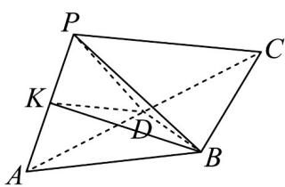

> [!faq]- 《专题05_线面位置关系的四大常考题型_高效培优专项训练_》官方解析
>
> > [!success]- **【答案】** (1)证明见解析 (2) $\frac{\sqrt{7}}{4}$
>
> > [!note]- **【分析】**
> > （1）取 $AP$ 中点 $K$ ，连接 $KB, KD$ ，根据线面垂直的判定定理可得 $AP \perp$ 平面 $BDK$ ，再由线面垂直的性质定理即可证明；
> >
> > (2) 设点 $P$ 到平面 $ABC$ 的距离为 $h$ ，直线 $PB$ 与平面 $ABC$ 所成角为 $\theta$ ，根据三棱锥的体积公式求出三棱锥的高，再结合线面角的求法即可求解.
>
> > [!note]- **【解析】**
> > （1）取AP中点K，连接KB,KD，
> >
> > 
> >
> > 由 $PD = DA$ ， $PB = BA$
> >
> > 得 $AP \perp BK$ ， $AP \perp DK$ ，
> >
> > 又因为 $BK \cap DK = K$ ，且 $BK$ ， $DK \subset$ 平面 $BDK$
> >
> > 所以 $AP \perp$ 平面 BDK ，
> >
> > 因为 $BD \subset$ 平面 BDK ，所以 $BD \perp AP$ .
> >
> > (2) 设点 $P$ 到平面 $ABC$ 的距离为 $h$ ，直线 $PB$ 与平面 $ABC$ 所成角为 $\theta$
> >
> > 则四面体 $P - ABC$ 的体积为 $\frac{1}{3} S_{\triangle ABC}\cdot h = \frac{1}{3}\times \frac{1}{2}\times 2\times 2\times \frac{\sqrt{3}}{2} h = \frac{\sqrt{3}}{3} h$
> >
> > 由题意有 $\frac{\sqrt{3}}{3} h = \frac{\sqrt{21}}{6}$ ，得 $h = \frac{\sqrt{7}}{2}$
> >
> > 故 $\sin \theta = \frac{h}{PB} = \frac{\sqrt{7}}{4}$ ，即直线 $P B$ 与平面 $A B C$ 所成角的正弦值为 $\frac{\sqrt{7}}{4}$
