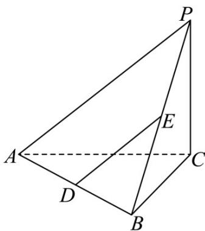

> [!faq]- 《专题05_线面位置关系的四大常考题型_高效培优专项训练_》官方解析
>
> > [!success]- **【答案】**  A. $DE / /$ 平面 $PAC$ B. $AB\bot PB$ C. $V_{A - PBC} = \frac{2}{3}$ D. $S_{P - ABC} = 4\sqrt{2} +4$
>
> > [!note]- **【分析】**
> > 对于 A，通过证明 DE//AP 即可得到 DE// 平面 PAC；由 PC⊥底面 ABC 可得 PC⊥AB，再结合 AB⊥BC 可得 AB⊥平面 PBC，进而得到 AB⊥PB；对于 C，根据三棱锥的体积公式求解判断即可；对于 D，分别求出三棱锥各个面的面积即可判断.
>
> > [!note]- **【解析】**
> > 对于 A，因为 D、E 分别是 AB，PB 的中点，所以 $DE \parallel AP$ ，
> >
> > 因为 $DE \notin$ 平面 PAC， $AP \subset$ 平面 PAC，所以 $DE \parallel$ 平面 PAC，故 A 正确；
> >
> > 对于 B，因为 $PC \perp$ 底面 ABC， $AB \subset$ 平面 ABC，所以 $PC \perp AB$
> >
> > 因为 $AB \perp BC$ ， $PC \cap BC = C, PC, BC \subset$ 平面 $PBC$
> >
> > 所以 $AB \perp$ 平面 PBC ，又 $PB \subset$ 平面 PBC ，所以 $AB \perp PB$ ，故 B 正确；
> >
> > 对于 C， $V_{A-PBC}=V_{P-ABC}=\frac{1}{3}S_{\triangle ABC}\cdot PC=\frac{1}{3}\times\frac{1}{2}\times2\times2\times2=\frac{4}{3}$ ，故 C 错误；
> >
> > 对于 D，由 $AB = BC = PC = 2$ ， $AB \perp BC$ ， $PC \perp BC$ ， $PC \perp AC$ ， $AB \perp PB$ ，
> >
> > 所以 $AC = 2\sqrt{2}, PB = 2\sqrt{2}$
> >
> > $$
> > S _ {P - A B C} = S _ {\triangle A B C} + S _ {\triangle P A B} + S _ {\triangle P A C} + S _ {\triangle P B C} = \frac {1}{2} \times 2 \times 2 + \frac {1}{2} \times 2 \times 2 \sqrt {2} + \frac {1}{2} \times 2 \sqrt {2} \times 2 + \frac {1}{2} \times 2 \times 2 = 4 \sqrt {2} + 4
> > $$
> >
> > 故 D 正确.
> >
> > 故选 **C**.
