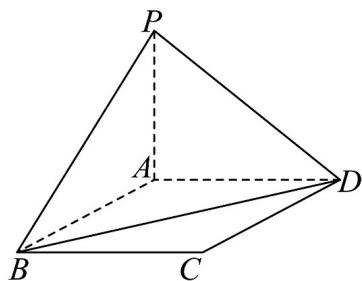
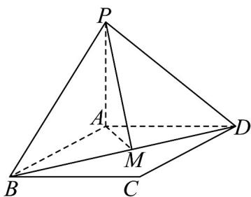

> [!faq]- 《专题05_线面位置关系的四大常考题型_高效培优专项训练_》官方解析
>
> > [!success]- **【答案】** 
>
> > [!note]- **【分析】**
> > 要求点 P 到直线 BD 的距离，需要作出 $PM \perp BD$ ，然后计算即可.
>
> > [!note]- **【解析】**
> > 
> >
> > 作 $PM \perp BD$ 于M，
> >
> > 因为 $PA \perp$ 平面 $ABCD, AB, AD \subset$ 平面 $ABCD$ , 所以 $PA \perp AB, PA \perp AD$ , 因为 $AB = AD = 2, PA = 1$ , 所以 $BP = DP = \sqrt{2^2 + 1^2} = \sqrt{5}$ , 因为正方形 $ABCD$ 边长为 2 , 所以 $BD = 2\sqrt{2}$ , 因为 $PM \perp BD$ , $BP = DP$ , 所以 $BM = DM = \sqrt{2}$ , 所以 $PM = \sqrt{PB^2 - BM^2} = \sqrt{5 - 2} = \sqrt{3}$ , 所以点 $P$ 到直线 $BD$ 的距离为 $\sqrt{3}$ . 故答案为： $\sqrt{3}$ .
