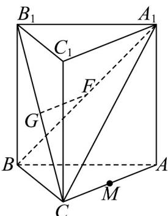

<!-- question-source:start -->
32. 如图，直三棱柱 $ABC - A_{1}B_{1}C_{1}$ 中， $AA_{1} = AC = BC = \frac{\sqrt{2}}{2} AB$ ，若 $G, F$ 分别是 $B_{1}C, A_{1}B$ 的中点。

(1)求证： $GF / /$ 平面 $ABC$

(2)求证：平面 $BCC_{1}B_{1}\perp$ 平面 $ACB_{1}$

(3)设 $M$ 是 $AC$ 中点，求直线 $B_{1}M$ 与平面 $ABC$ 所成角的正弦值.
<!-- question-source:end -->

![[高中/课堂同步/题库/人教A版高中数学同步讲义(2026)/02_必修第二册/第八章 立体几何初步/专项训练/专题05_线面位置关系的四大常考题型_高效培优专项训练_/题型四_sec_04/questions/answers/Q00065142A1.md]]
