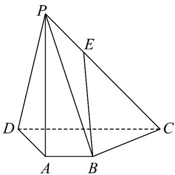

<!-- question-source:start -->
33．如图，在四棱锥 P-ABCD 中， $PA \perp$ 平面 ABCD， $PD \perp AB$ ， $AB // DC$ ，DC = 3AB = 3，AD = 2，
PA = 3，E为棱PC上一点，且 $PE = \frac{1}{3} PC$

(1)求证： $BE \parallel$ 平面 PAD；

(2)求证：平面 $PAD \perp$ 平面PCD；

(3)求直线 $PC$ 与平面 $PAD$ 所成角的正切值.
<!-- question-source:end -->

![[高中/课堂同步/题库/人教A版高中数学同步讲义(2026)/02_必修第二册/第八章 立体几何初步/专项训练/专题05_线面位置关系的四大常考题型_高效培优专项训练_/题型四_sec_04/questions/answers/Q00065143A1.md]]
