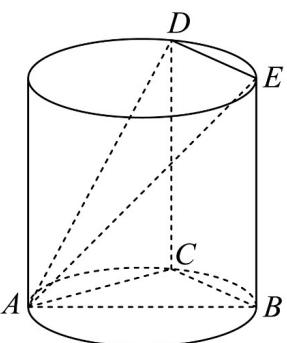

<!-- question-source:start -->
34．如图，已知 $AB$ 是圆柱下底面圆的直径，点 $C$ 是下底面圆周上异于 $A$ ， $B$ 的动点， $CD$ ， $BE$ 是圆柱的两条母线．

(1)求证：平面 $ACD \perp$ 平面 BCDE；

(2)若 $AB = 5, BC = 2$ ，圆柱的母线长为 $2\sqrt{3}$ ，求平面 $ADE$ 与平面 $ABC$ 夹角的余弦值.
<!-- question-source:end -->

![[高中/课堂同步/题库/人教A版高中数学同步讲义(2026)/02_必修第二册/第八章 立体几何初步/专项训练/专题05_线面位置关系的四大常考题型_高效培优专项训练_/题型四_sec_04/questions/answers/Q00065144A1.md]]
