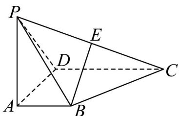

<!-- question-source:start -->
38．如图，四棱锥 P-ABCD，PA⊥平面 ABCD，AB⊥AD，AB∥CD，CD=2AB，PA=AD，E 是 PC 的中点．

(1)求证： $BE \parallel$ 平面 PAD；

(2)求证：平面 $PBC \perp$ 平面 $PCD$
<!-- question-source:end -->

![[高中/课堂同步/题库/人教A版高中数学同步讲义(2026)/02_必修第二册/第八章 立体几何初步/专项训练/专题05_线面位置关系的四大常考题型_高效培优专项训练_/题型四_sec_04/questions/answers/Q00065148A1.md]]
