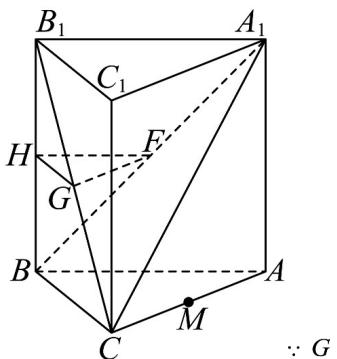
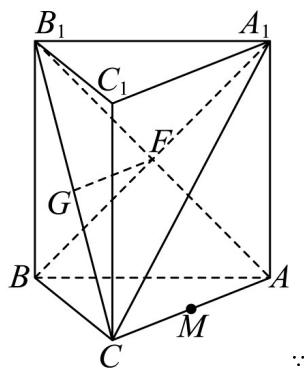
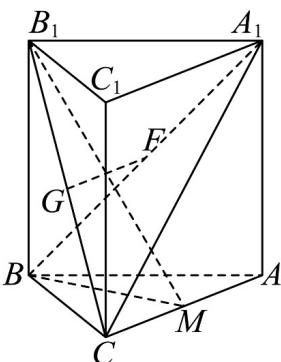

> [!faq]- 《专题05_线面位置关系的四大常考题型_高效培优专项训练_》官方解析
>
> > [!success]- **【答案】** (1)证明见解析 (2)证明见解析 (3) $\frac{2}{3}$
>
> > [!note]- **【分析】**
> > （1）法一：取 $BB_{1}$ 中点H，连接HG，HF，利用线面平行的判定定理证得HG//平面ABC，HF//平面ABC，进而利用面面平行的判定定理得平面HGF//平面ABC，最后利用面面平行的性质定理证明即可；
> >
> > 法二：连接 $B_{1}A$ ，根据中位线的性质得 $FG//CA$ ，然后利用线面平行的判定定理证明即可；
> >
> > （2）利用棱柱性质得 $BB_{1} \perp AC$ ，根据勾股定理得 $AC \perp BC$ ，进而利用线面垂直的性质定理得 $AC \perp$ 平面 $BCB_{1}C_{1}$ ，最后利用面面垂直的判定定理证明即可；
> >
> > (3) 连接 $MB$ ， $MB_{1}$ ，利用线面角的定义得 $\angle B_{1}MB$ 即为所求的线面角，在直角三角形中求解正弦值即可；
>
> > [!note]- **【解析】**
> > （1）法一：取 $BB_{1}$ 中点H，连接HG，HF，
> >
> > 
> >
> > ， $H$ ， $F$ 分别为 ，和中点.
> >
> > $$
> > B _ {1} B
> > $$
> >
> > $$
> > A _ {1} B
> > $$
> >
> > ∴HG//BC， $HF//B_{1}A_{1}$ ，∵ $A_{1}B_{1}//AB$ ，从而HF//AB，
> >
> > $HG\notin$ 平面 $ABC$ ， $HF\notin$ 平面 $ABC$ ， $BC\notin$ 平面 $ABC$ ， $AB\notin$ 平面 $ABC$
> >
> > ∴ HG// 平面 ABC ， HF// 平面 ABC ， HG ⊂ 平面 HGF ， HF ⊂ 平面 HGF ，
> >
> > ∵ HG 与 HF 在平面 HGF 内且相交，∴ 平面 $HGF \parallel$ 平面 ABC，
> >
> > ∵ $GF \subset$ 平面 HGF ∴ $GF \parallel$ 平 ABC.
> >
> > 法二：连接 $B_{1}A$ ，
> >
> > 
> >
> > 为 中点 为 中点， 为 中
> >
> > $\because F \quad BA_{1} \quad \therefore F \quad B_{1}A \quad \because G \quad B_{1}C \quad \therefore FG // CA$
> >
> > ∵ $CA \subset$ 平面 ABC ， $GF \notin$ 平面 ABC ， ∴ $FG \parallel$ 平面 ABC .
> >
> > (2) 在直棱柱 $ABC - A_{1}B_{1}C_{1}$ 中， $BB_{1} \perp$ 平面 ABC，
> >
> > $\because AC \subset \text{平面} ABC, \therefore BB_{1} \perp AC$
> >
> > 不妨设 $AA_{1}=1$ ，∵ $AA_{1}=AC=BC=\frac{\sqrt{2}}{2}AB$ ，∴ AC=BC=1， $AB=\sqrt{2}$ ，
> >
> > $\therefore CA^{2} + CB^{2} = AB^{2}\quad \therefore AC \perp BC$
> >
> > 又∵ BC 与 $BB_{1}$ 在平面 $BCC_{1}B_{1}$ 内且相交，∴ $AC \perp$ 平面 $BCB_{1}C_{1}$
> >
> > ∵ $AC \subset$ 平面 $ACB_{1}$ ，∴ 平面 $ACB_{1} \perp$ 平面 $BCB_{1}C_{1}$ .
> >
> > (3) 连接 MB， $MB_{1}$ ，
> >
> > ∵ $BB_{1} \perp$ 平面 ABC ，∴ 直线 BM 为直线 $B_{1}M$ 在平面 ABC 内的射影，
> >
> > $\therefore \angle B_{1}MB$ 是 $B_{1}M$ 与平面 $ABC$ 所成的角，
> >
> > 在 $\triangle B_{1}BM$ 中， $BM = \sqrt{BC^{2} + CM^{2}} = \sqrt{1 + \frac{1}{4}} = \frac{\sqrt{5}}{2}$
> >
> > $$
> > B _ {1} M = \sqrt {B B _ {1} ^ {2} + B M ^ {2}} = \sqrt {1 + \frac {5}{4}} = \frac {3}{2}
> > $$
> >
> > 故 $\sin\angle B_{1}MB=\frac{BB_{1}}{B_{1}M}=\frac{2}{3}$
> >
> > 
