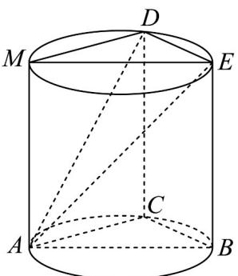

> [!faq]- 《专题05_线面位置关系的四大常考题型_高效培优专项训练_》官方解析
>
> > [!success]- **【答案】** (1)证明见解析 (2) $\frac{\sqrt{77}}{11}$
>
> > [!note]- **【分析】**
> > （1）先证明线面垂直，通过线面垂直得到线线垂直，再证线面垂直，最后得到面面垂直即可；
> >
> > （2）先作出底面的垂线，再由垂足作两个面的交线的垂线，最后连接交线的垂足与斜足构成二面角的平面角求解即可.
>
> > [!note]- **【解析】**
> > （1）因为 $AB$ 是底面圆的一条直径， $C$ 是下底面圆周上异于 $A, B$ 的动点，所以 $AC \perp BC$ ，
> >
> > 又因为 CD 是圆柱的一条母线，所以 $CD \perp$ 底面 ABC，
> >
> > 而 $AC \subset$ 底面 $ABC$ ，所以 $CD \perp AC$
> >
> > 因为 $CD \subset$ 平面 $BCDE, BC \subset$ 平面 $BCDE$ , 且 $CD \cap BC = C$
> >
> > 所以 $AC \perp$ 平面 BCDE，
> >
> > 又因为 $AC \subset$ 平面 ACD，所以平面 $ACD \perp$ 平面 BCDE。
> >
> > (2) 如图所示，过点 $A$ 作圆柱的母线 $AM$ ，连接 $DM$ ， $EM$ 。
> >
> > 
> >
> > 因为底面 $ABC //$ 底面DME，所以即求平面ADE与平面DME的夹角.
> >
> > 因为 M, E 在底面 ABC 的射影为 A, B, 且 AB 为下底面圆的直径,
> >
> > 所以 EM 为上底面圆的直径，
> >
> > 因为 $AM$ 是圆柱的母线，所以 $AM \perp$ 平面 $DME$
> >
> > 因为 $DE \subset$ 平面 $DME$ ，所以 $AM \perp DE$
> >
> > 又因为 EM 为上底面圆的直径，所以 $MD \perp DE$ ，
> >
> > 因为 $AM, DM \subset$ 平面 $AMD, AM \cap DM = M$ ，所以 $DE \perp$ 平面 $AMD$
> >
> > 因为 $AD \subset$ 平面 $AMD$ ，所以 $DE \perp AD$ ，又因为平面 $ADE \cap$ 平面 $DME = DE$
> >
> > 所以 $\angle MDA$ 为平面 $ADE$ 与平面 $DME$ 的夹角，
> >
> > 又因为 $D$ 在底面 $ABC$ 的射影为 $C$ ，所以 $DE = BC = 2, ME = AB = 5$
> >
> > 所以 $DM = \sqrt{5^2 - 2^2} = \sqrt{21}$ ，又因为母线长为 $2\sqrt{3}$ ，所以 $AM = 2\sqrt{3}$
> >
> > 又因为 $AM \perp$ 平面 $DME, DM \subset$ 平面 $DME$ , 所以 $AM \perp MD$
> >
> > 所以 $AD = \sqrt{(2\sqrt{3})^2 + (\sqrt{21})^2} = \sqrt{33}$
> >
> > 所以 $\cos \angle MDA = \frac{\sqrt{21}}{\sqrt{33}} = \frac{\sqrt{77}}{11}$
> >
> > 即平面 $ADE$ 与平面 $ABC$ 夹角的余弦值为 $\frac{\sqrt{77}}{11}$
