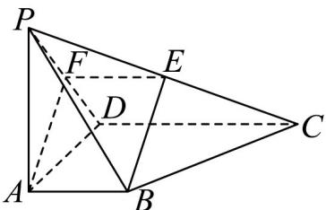

> [!faq]- 《专题05_线面位置关系的四大常考题型_高效培优专项训练_》官方解析
>
> > [!success]- **【答案】** (1)证明见解析； (2)证明见解析；
>
> > [!note]- **【分析】**
> > （1）取 $PD$ 的中点 $F$ ，连接 $AF, EF$ ，证明 $BE \parallel AF$ ，根据线面平行的判定即可证得 $BE \parallel$ 平面 $PAD$ ；
> >
> > (2) 由 $PA \perp$ 平面 $ABCD$ ，根据线面垂直的性质及判定得到 $AB \perp AF$ 。结合 $PA = AD$ 及 $F$ 是 $PD$ 的中点，得到 $AF \perp PD$ ，再根据 $AB \parallel CD$ ， $BE \parallel AF$ ，可得到 $BE \perp PD, BE \perp CD$ ，证得 $BE \perp$ 平面 $PCD$ ，从而平面 $BEF \perp$ 平面 $PCD$ 得证。
>
> > [!note]- **【解析】**
> > （1）取 $PD$ 的中点 $F$ ，连接 $AF, EF$ ， $\because E$ 是 $PC$ 的中点，
> >
> > $$
> > \therefore C D = 2 E F, E F \parallel C D
> > $$
> >
> > ∵ AB∥ CD ， CD = 2AB ，
> >
> > $\therefore EF \parallel AB, EF = AB, \therefore$ 四边形 $ABEF$ 是平行四边形.
> >
> > $\therefore BE \parallel AF,$
> >
> > 又∵ $BE \not\subset$ 平面 PAD ， $AF \subset$ 平面 PAD ，
> >
> > $\therefore BE \parallel$ 平面 $PAD$ .
> >
> > 
> >
> > (2) $\because PA \perp$ 平面 $ABCD$ , $CD \subset$ 平面 $ABCD$ , $\therefore PA \perp AB$ .
> >
> > ∵ $AB \perp AD$ ， $PA \cap AD = A$ ， $PA, AD \subset$ 平面 PAD，∴ $AB \perp$ 平面 PAD，
> >
> > ∵ AF ⊂ 平面 PAD ，∴ AB ⊥ AF .
> >
> > ∵AB∥ CD ，∴CD⊥AF.
> >
> > ∵ PA = AD ， F 是 PD 的中点，∴ $AF \perp PD$
> >
> > 由（1）知 $BE\parallel AF$ ， $\therefore BE\perp PD,BE\perp CD$
> >
> > 又 $PD \cap CD = D, PD, CD \subset$ 平面 $PCD$ , $\therefore BE \perp$ 平面 $PCD$ .
> >
> > ∵BE⊂平面PBC，
> >
> > ∴平面 $PBC \perp$ 平面 PCD.
