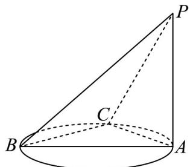

> [!faq]- 《专题05_线面位置关系的四大常考题型_高效培优专项训练_》官方解析
>
> > [!success]- **【答案】**  A. $PB\bot AC$ B. $PC\bot BC$ C.平面 $ABC\bot$ 平面 $PAC$ D.平面 $PBC\bot$ 平面 $PAC$
>
> > [!note]- **【分析】**
> > 根据面面垂直的判定定理、线面垂直的性质和判定定理对选项逐一判断即可.
>
> > [!note]- **【解析】**
> > 对于选项A：
> >
> > 假设 $PB \perp AC$ ，因为 $BC \perp AC, PB \cap BC = B, PB, BC \subset$ 平面 $PBC$
> >
> > 所以 $AC \perp$ 平面 $PBC$ ，又 $PC \subset$ 平面 $PBC$
> >
> > 所以 $AC \perp PC$ ，而 $PA \perp$ 平面 $ABC, AC \subset$ 平面 ABC，所以 $AC \perp PA$
> >
> > 在VPCA中， $PA \perp AC, PC \perp AC$ ，不能同时成立，所以A错误；
> >
> > 对于选项B：
> >
> > 因为 $PA \perp$ 平面 $ABC, BC \subset$ 平面 ABC ，所以 $BC \perp PA$
> >
> > 因为 $BC \perp AC, PA \cap AC = A, PA, AC \subset$ 平面 $PAC$
> >
> > 所以 $BC \perp$ 平面 PAC，又 $PC \subset$ 平面 PAC，所以 $PC \perp BC$ ，选项 B 正确；
> >
> > 对于选项 C :
> >
> > 因为 $PA \perp$ 平面 $ABC, PA \subset$ 平面 PAC ，所以平面 $ABC \perp$ 平面 PAC ，所以 C 正确；
> >
> > 对于选项D：
> >
> > 由选项 B 可知 $BC \perp$ 平面 PAC，因为 $BC \subset$ 平面 PBC，所以平面 $PBC \perp$ 平面 PAC，所以 D 正确.
> >
> > 故选 **BCD**.
