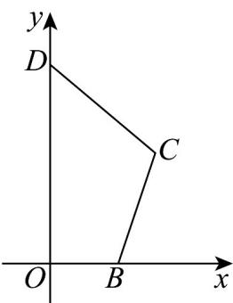

<!-- question-source:start -->
8. 用斜二测画法画出图中四边形 $OBCD$ 的直观图.

<!-- question-source:end -->

![[高中/课堂同步/题库/人教A版高中数学同步讲义(2026)/02_必修第二册/第八章 立体几何初步/专题01 立体图形直观图考点的四大常考题型（高效培优专项训练）/题型一_斜二测画直观图/questions/answers/Q00069535A1.md]]
