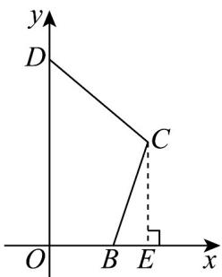
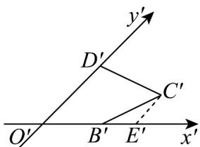
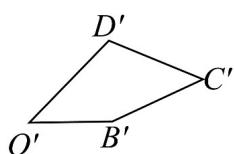

> [!faq]- 《专题01 立体图形直观图考点的四大常考题型》官方解析
>
> > [!success]- **【答案】** 答案见解析
>
> > [!note]- **【分析】**
> > 根据斜二测画法的规则和步骤，将直角画成 $45^{\circ}$ ，沿 $x'$ 轴方向长度不变， $y'$ 轴方向是原图形长度的一半，即可做出直观图。
>
> > [!note]- **【解析】**
> > 分以下三步进行作图：
> >
> > (1) 过点 C 作 $CE \perp x$ 轴，垂足为 E，如图①所示.
> >
> > 
> > 图1
> >
> > 
> > 图2
> >
> > 
> > 图3
> >
> > (2) 画出对应的 $x'$ 轴、 $y'$ 轴，使 $\angle x'O'y' = 45^\circ$
> >
> > 在 $x'$ 轴上取点 $B'$ ， $E'$ ，使得 $O'B' = OB$ ， $O'E' = OE$ ；
> >
> > 在 $y'$ 轴上取一点 $D^{Φ}$ ，使得 $O'D' = \frac{1}{2} OD$ ；
> >
> > 过 $E^{\prime}$ 作 $E^{\prime}C^{\prime} / / y^{\prime}$ 轴，使 $E^{\prime}C^{\prime} = \frac{1}{2} EC$ ，连接 $B^{\prime}C^{\prime}$ ， $C^{\prime}D^{\prime}$ ，如图②所示.
> >
> > (3) 擦去 $x'$ 轴与 $y'$ 轴及其他辅助线，
> >
> > 如图③所示，四边形 $O^{\prime}B^{\prime}C^{\prime}D^{\prime}$ 就是所求的直观图．
> >
> > 9. 利用斜二测画法画水平放置的平面图形的直观图，得到：
> > - **①**：三角形的直观图是三角形；
> > - **②**：平行四边形的直观图是平行四边形；
> > - **③**：正方形的直观图可能仍是正方形；
> > - **④**：菱形的直观图是一定是菱形.
> >
> > 以上结论，正确的是（ ）A. $①②$ B. $①$ C. $③④$ D. $①②③④$
> >
> > 【答案】A
> >
> > 【分析】根据斜二测画法画直观图的画法规则，对各结论逐一判断，即可得到结果.
> >
> > 【详解】由斜二测画直观图的画法知：已知图形中平行于 $x$ 轴的线段，在直观图中平行于 $x'$ 轴，保持长度不变；已知图形中平行于 $y$ 轴的线段，在直观图中平行于 $y'$ 轴，长度变为原来的一半.
> > - **对于①**：三角形的直观图是三角形，①正确；
> > - **对于②**：平行四边形的直观图是平行四边形，②正确；
> > - **对于③**：正方形的直观图是平行四边形，③错误；
> > - **对于④**：菱形的直观图是平行四边形，④错误；
> >
> > 故选 **A**.
