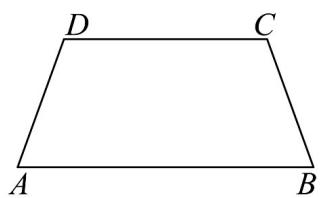
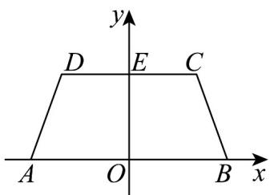
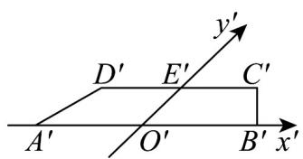

## 题型一：斜二测画直观图

1. 画出如图所示水平放置的等腰梯形的直观图。

【答案】答案见解析

【分析】运用斜二测画法画图即可.

【详解】画法：（1）如图所示，取 $AB$ 所在直线为 $x$ 轴， $AB$ 的中点 $O$ 为原点，建立直角坐标系，画对应的坐标系 $x'O'y'$ ，使 $\angle x'O'y' = 45^\circ$ 。

(2) 以 $O'$ 为中点在 $x'$ 轴上取 $A'B' = AB$ ，在 $y'$ 轴上取 $O'E' = \frac{1}{2} OE$ ，以 $E'$ 为中点画 $C'D' // x'$ 轴，并使 $C'D' = CD$ 。

(3) 连接 $B^{\prime}C^{\prime}$ , $D^{\prime}A^{\prime}$ , 所得的四边形 $A^{\prime}B^{\prime}C^{\prime}D^{\prime}$ 就是水平放置的等腰梯形 $ABCD$ 的直观图.

![[高中/课堂同步/题库/人教A版高中数学同步讲义(2026)/02_必修第二册/第八章 立体几何初步/专题01 立体图形直观图考点的四大常考题型（高效培优专项训练）/题型一_斜二测画直观图/questions/Q00069531.md]]
![[高中/课堂同步/题库/人教A版高中数学同步讲义(2026)/02_必修第二册/第八章 立体几何初步/专题01 立体图形直观图考点的四大常考题型（高效培优专项训练）/题型一_斜二测画直观图/questions/Q00069532.md]]
![[高中/课堂同步/题库/人教A版高中数学同步讲义(2026)/02_必修第二册/第八章 立体几何初步/专题01 立体图形直观图考点的四大常考题型（高效培优专项训练）/题型一_斜二测画直观图/questions/Q00069533.md]]
![[高中/课堂同步/题库/人教A版高中数学同步讲义(2026)/02_必修第二册/第八章 立体几何初步/专题01 立体图形直观图考点的四大常考题型（高效培优专项训练）/题型一_斜二测画直观图/questions/Q00069534.md]]
![[高中/课堂同步/题库/人教A版高中数学同步讲义(2026)/02_必修第二册/第八章 立体几何初步/专题01 立体图形直观图考点的四大常考题型（高效培优专项训练）/题型一_斜二测画直观图/questions/Q00069535.md]]
![[高中/课堂同步/题库/人教A版高中数学同步讲义(2026)/02_必修第二册/第八章 立体几何初步/专题01 立体图形直观图考点的四大常考题型（高效培优专项训练）/题型一_斜二测画直观图/questions/Q00069536.md]]
