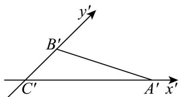
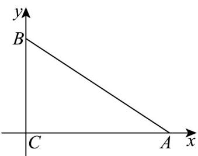

> [!faq]- 《专题01 立体图形直观图考点的四大常考题型》官方解析
>
> > [!success]- **【答案】** 
>
> > [!note]- **【分析】**
> > 结合斜二测画法的性质将图还原后计算即可得.
>
> > [!note]- **【解析】**
> > 
> >
> > 如图，将直观图化成平面图中， $\angle BCA = 90^{\circ}, AC = A'C' = 3$ ， $BC = 2B'C' = 2$
> >
> > 所以 $AB = \sqrt{2^{2} + 3^{2}} = \sqrt{13}.$
> >
> > 故答案为： $\sqrt{13}$
