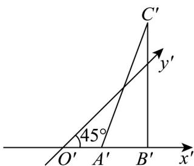
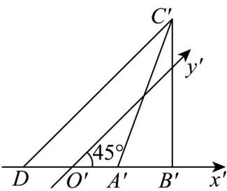
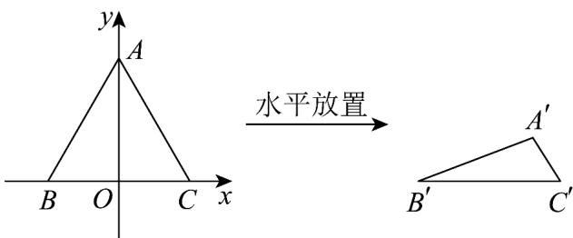
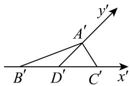

> [!faq]- 《专题01 立体图形直观图考点的四大常考题型》官方解析
>
> > [!success]- **【答案】** 
>
> > [!note]- **【分析】**
> > 过 $C'$ 作 $C'D // y'$ ，结合斜二测的性质进行求解即可。
>
> > [!note]- **【解析】**
> > 过 $C'$ 作 $C'D // y'$ ，则 $\angle C'DB' = 45^\circ$
> >
> > ∵ $B^{\prime}C^{\prime}$ 与 $x^{\prime}$ 轴垂直，且 $B^{\prime}C^{\prime}=3$ ，
> >
> > $$
> > \therefore C ^ {\prime} D = \sqrt {(C ^ {\prime} D) ^ {2} + (B ^ {\prime} C ^ {\prime}) ^ {2}} = 3 \sqrt {2}
> > $$
> >
> > 则VABC的边AB上的高等于 $2C^{\prime}D=6\sqrt{2}$
> >
> > 故答案为： $6\sqrt{2}$
> >
> > 
> >
> > 24. 将边长为 20 的正三角形 ABC，按“斜二测”画法在水平放置的平面上画出为 $\triangle A'B'C'$ ，则 $A'C' =$ \_\_\_\_ .
> >
> > 【答案】
> >
> > 
> >
> > 【答案】 $5(\sqrt{6} - 1)$
> >
> > 【分析】先在直角坐标系中得出各边的数值，再按“斜二测”画法作图，得出相关关系，再利用余弦定理，求出边 $A^{\prime}C^{\prime}$
> >
> > 【详解】由题意，在平面直角坐标系中，三角形 ABC 是边长为 20 的正三角形，
> >
> > $\therefore AB = BC = 20$ ， $BC$ 边上的高为 $h = 10\sqrt{3}$
> >
> > 按“斜二测”画法如下图所示：
> >
> > 
> >
> > $$
> > B ^ {\prime} D ^ {\prime} = C ^ {\prime} D ^ {\prime} = \frac {1}{2} B C = 1 0, A ^ {\prime} D ^ {\prime} = \frac {1}{2} h = \frac {1}{2} \times 1 0 \sqrt {3} = 5 \sqrt {3}
> > $$
> >
> > 在三角形 $A^{\prime}C^{\prime}D^{\prime}$ 中， $\angle A^{\prime}D^{\prime}C^{\prime} = 45^{\circ}$
> >
> > 由余弦定理得，
> >
> > $$
> > A ^ {\prime} C ^ {\prime} = \sqrt {A ^ {\prime} D ^ {\prime 2} + C ^ {\prime} D ^ {\prime 2} - 2 A ^ {\prime} D ^ {\prime} \cdot C ^ {\prime} D ^ {\prime} \cos \angle A ^ {\prime} D ^ {\prime} C ^ {\prime}} = \sqrt {(5 \sqrt {3}) ^ {2} + 1 0 ^ {2} - 2 \times 5 \sqrt {3} \times 1 0 \times \cos 4 5 ^ {\circ}} = 5 (\sqrt {6} - 1)
> > $$
> >
> > 故答案为： $5(\sqrt{6}-1)$
