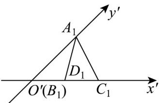
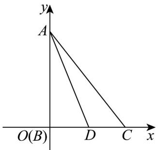

> [!faq]- 《专题01 立体图形直观图考点的四大常考题型》官方解析
>
> > [!success]- **【答案】**  A. $AB = BC = AC$ B. $AD\perp BC$ C. $AB\perp BC$ D. $AC > AD > AB > BC$
>
> > [!note]- **【分析】**
> > 根据斜二测画法作出的水平放置的直观图和平面直角坐标系中图形关系，进行辨析即可.
>
> > [!note]- **【解析】**
> > 由直观图知 $\vee ABC$ 为直角三角形，在平面直角坐标系中如图所示，
> >
> > 
> >
> > $$
> > A B = 2 A _ {1} B _ {1}
> > $$
> >
> > $$
> > B C = B _ {1} C _ {1}
> > $$
> >
> > 又 $A_{1}B_{1} = B_{1}C_{1}$ ，故A，B错误，C，D正确.
> >
> > 故选 **CD**.
