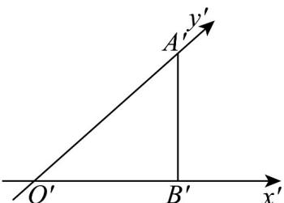
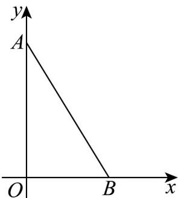

> [!faq]- 《专题01 立体图形直观图考点的四大常考题型》官方解析
>
> > [!success]- **【答案】**  A. $4\sqrt{2} + 2$ B. $2 + 2\sqrt{2}$ C. $4\sqrt{2} + 4$ D. $4 + 2\sqrt{2}$
>
> > [!note]- **【分析】**
> > 根据直观图运用斜二测画法，还原原图即可解决.
>
> > [!note]- **【解析】**
> > 因为 $B^{\prime}A^{\prime} = B^{\prime}O^{\prime} = 1$ ，由直观图可知， $O^{\prime}A^{\prime} = \sqrt{2}$
> >
> > 
> >
> > 所以还原平面图形中， $OA = 2\sqrt{2}$ ， $OB = O'B' = 1$
> >
> > 在 Rt△AOB 中， $AB=\sqrt{(2\sqrt{2})^{2}+1^{2}}=3$ ，则三角形 ABO 的周长为 $2\sqrt{2}+1+3=2\sqrt{2}+4$ 。
> >
> > 故选 **D**.
