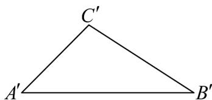

<!-- question-source:start -->
16．如图，若三角形 $A^{\prime}B^{\prime}C^{\prime}$ 是用斜二测画法画出的水平放置的平面图形ABC的直观图．已知 $A^{\prime}B^{\prime}=4$ ， $\angle C^{\prime}A^{\prime}B^{\prime}=45^{\circ}$ ，三角形 $A^{\prime}B^{\prime}C^{\prime}$ 的面积为 $2\sqrt{2}$ ．则原平面图形ABC中BC的长度为\_\_\_\_．

<!-- question-source:end -->

![[高中/课堂同步/题库/人教A版高中数学同步讲义(2026)/02_必修第二册/第八章 立体几何初步/专题01 立体图形直观图考点的四大常考题型（高效培优专项训练）/题型二_直观图还原几何图形/questions/answers/Q00069542A1.md]]
