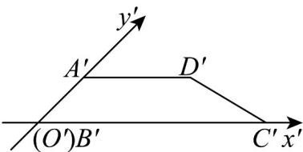

> [!faq]- 《专题01 立体图形直观图考点的四大常考题型》官方解析
>
> > [!success]- **【答案】** 
>
> > [!note]- **【分析】**
> > 把直观图还原, 可知是直角梯形, 利用梯形面积公式可求答案.
>
> > [!note]- **【解析】**
> > 根据斜二测画法，还原成平面图形后，得到 $AB = 2A'B' = 2, AB \perp BC$ ；
> >
> > 水平方向长度不变，则四边形 ABCD 是直角梯形， $S_{\square ABCD}=\frac{1}{2}\times(2+4)\times2=6$
> >
> > 故答案为：6.
