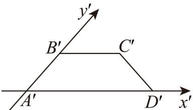
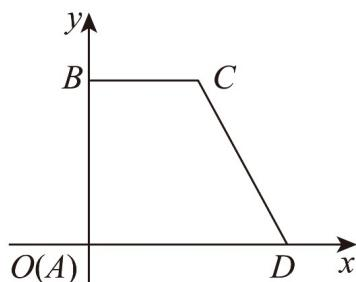

> [!faq]- 《专题01 立体图形直观图考点的四大常考题型》官方解析
>
> > [!success]- **【答案】**  A. $3\sqrt{2}$ B.2 C.3 D. $2\sqrt{2}$
>
> > [!note]- **【分析】**
> > 运用斜二测画法得到原图，再用梯形面积公式计算即可.
>
> > [!note]- **【解析】**
> > 如图，作平面直角坐标系 $xOy$ ，使 $A$ 与 $O$ 重合， $AD$ 在 $x$ 轴上，且 $AD = 2$ ， $AB$ 在 $y$ 轴上，且 $AB = 2$ ，
> >
> > 过 $B$ 作 $BC // AD$ ，且 $BC = 1$ ，连接 $CD$ ，则直角梯形 $ABCD$ 为原平面图形，其面积为 $S = \frac{1}{2} \times (1 + 2) \times 2 = 3$
> >
> > 
> >
> > 故选 **C**.
