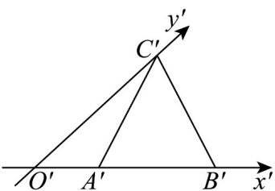
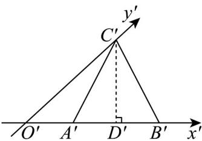
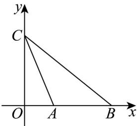

> [!faq]- 《专题01 立体图形直观图考点的四大常考题型》官方解析
>
> > [!success]- **【答案】**  A. $AB = 2$ B. $BC = \sqrt{41}$ C. $AC = BC$ D. $S_{\triangle ABC} = 4\sqrt{2}$
>
> > [!note]- **【分析】**
> > 由斜二测画法的规则复原为原图形，求解相关量逐项判断即可.
>
> > [!note]- **【解析】**
> > 
> >
> > 
> >
> > 如图1，在 $\triangle A'B'C'$ 中，作 $C'D' \perp A'B'$ 交 $A'B'$ 于点 $D\Phi$
> >
> > 因为 $A'B' = 2, A'C' = B'C' = \sqrt{5}$ ，所以 $A'D' = 1$ ， $C'D' = \sqrt{5 - 1} = 2$
> >
> > 又 $\angle C^{\prime}O^{\prime}D^{\prime} = 45^{\circ}$ ，所以 $O^{\prime}D^{\prime} = 2$ ， $O^{\prime}A^{\prime} = 1$ ， $O^{\prime}C^{\prime} = 2\sqrt{2}$
> >
> > 利用斜二测画法将直观图 $\triangle A'B'C'$ 还原为原平面图形 $\vee ABC$ ，如图2所示.
> >
> > 由斜二测画法，可得 $OC = 2O'C' = 4\sqrt{2}$ ， $OA = O'A' = 1$ ， $AB = A'B' = 2$
> >
> > 所以 $AC = \sqrt{32 + 1} = \sqrt{33}$ ， $BC = \sqrt{32 + 9} = \sqrt{41}$ ，
> >
> > $$
> > S _ {\vee A B C} = \frac {1}{2} A B \cdot O C = 4 \sqrt {2}
> > $$
> >
> > 故选 **ABD**.
