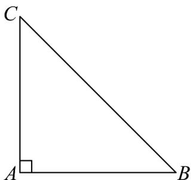

> [!faq]- 《专题01 立体图形直观图考点的四大常考题型》官方解析
>
> > [!success]- **【答案】** $4 \sqrt{2}$
>
> > [!note]- **【分析】**
> > 利用三角形面积公式求出 $A^{\prime}C^{\prime} = 2$ ，再作出原平面图形，利用勾股定理计算可得；
>
> > [!note]- **【解析】**
> > 因为 $A'B' = 4$ ， $\angle C'A'B' = 45^{\circ}$ ，且三角形 $A'B'C'$ 的面积为 $2\sqrt{2}$
> >
> > 所以 $S_{\triangle A'B'C'} = \frac{1}{2} A'B'\times A'C'\sin \angle C'A'B' = \sqrt{2} A'C' = 2\sqrt{2}$
> >
> > 所以 $A^{\prime}C^{\prime}=2$
> >
> > 三角形 $A^{\prime}B^{\prime}C^{\prime}$ 的原平面图形如图所示，
> >
> > 所以 $AC = 2A^{\prime}C^{\prime} = 4$ ， $AB = 4$ 且 $AC\perp AB$
> >
> > 所以 $BC = \sqrt{AC^{2} + AB^{2}} = 4\sqrt{2}$
> >
> > 
> >
> > 故答案为： $4\sqrt{2}$ .
