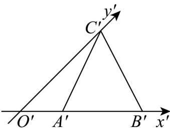
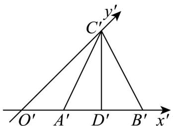
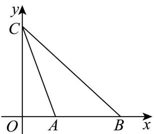

> [!faq]- 《专题01 立体图形直观图考点的四大常考题型》官方解析
>
> > [!success]- **【答案】**  A. $AC = BC$ B. $AB = 2$ C. $AC = 2\sqrt{5}$ D. $S_{\triangle ABC} = 4\sqrt{2}$
>
> > [!note]- **【分析】**
> > 首先算出 $O^{\prime}C^{\prime}$ 长度，再利用斜二测画法将直观图还原为原平面图形，从而判断各个选项正误。【详解】如图所示，在直观图 $\triangle A'B'C'$ 中，过 $C'$ 作 $C'D' \perp A'B'$ 于 $D\Phi$ ，
>
> > [!note]- **【解析】**
> > 
> > $$
> > A ^ {\prime} B ^ {\prime} = 2, A ^ {\prime} C ^ {\prime} = B ^ {\prime} C ^ {\prime} = \sqrt {5}, \therefore A ^ {\prime} D ^ {\prime} = 1, C ^ {\prime} D ^ {\prime} = \sqrt {A ^ {\prime} C ^ {\prime 2} - A ^ {\prime} D ^ {\prime 2}} = 2
> > $$
> > 又 $\angle C^{\prime}O^{\prime}D^{\prime} = 45^{\circ},\therefore O^{\prime}D^{\prime} = 2,O^{\prime}A^{\prime} = 1,O^{\prime}C^{\prime} = 2\sqrt{2}$
> > 所以利用斜二测画法将直观图 $\triangle A^{\prime}B^{\prime}C^{\prime}$ 还原为原平面图形 $\vee ABC$ ，如图：
> > 
> > 那么有 $OC = 4\sqrt{2}, OA = 1, AB = 2$ ，故选项B正确；
> > 又因为 $AC = \sqrt{OA^{2} + OC^{2}} = \sqrt{33}$ , $BC = \sqrt{OB^{2} + OC^{2}} = \sqrt{41}$ ，故选项 A、C 错误；
> > 而 $S_{\triangle ABC} = \frac{1}{2}\times AB\times OC = \frac{1}{2}\times 2\times 4\sqrt{2} = 4\sqrt{2}$ ，故选项D正确.
> >
> > 故选 **BD**.
