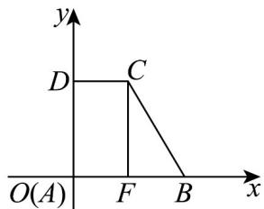

> [!faq]- 《专题01 立体图形直观图考点的四大常考题型》官方解析
>
> > [!success]- **【答案】** $10+2\sqrt{3}+2\sqrt{2}$
>
> > [!note]- **【分析】**
> > 将直观图复原为原图，求出相关线段的长，即可求得答案.
>
> > [!note]- **【解析】**
> > 由题意知在直观图等腰梯形 $A'B'C'D'$ ， $A'B' = 6$ ， $C'D' = 4, \angle D'O'B' = 45^\circ$
> >
> > 则 $A^{\prime}D^{\prime}=\sqrt{2}\times\frac{6-4}{2}=\sqrt{2}$ ;
> >
> > 将直观图复原为原图，如图示：
> >
> > 
> >
> > 则 $AB = 6, CD = 4, AD = 2\sqrt{2}$
> >
> > 作 $CF \perp AB$ 于 $F$ ，则 $FB = 2, CF = 2\sqrt{2}, \therefore BC = \sqrt{4 + 8} = 2\sqrt{3}$
> >
> > 故四边形 $ABCD$ 的周长为 $10 + 2\sqrt{3} + 2\sqrt{2}$
> >
> > 故答案为： $10+2\sqrt{3}+2\sqrt{2}$
