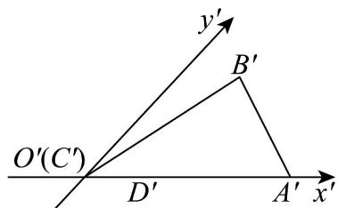

<!-- question-source:start -->
31. 如图， $\triangle A'B'C'$ 是水平放置的平面图形的斜二测直观图。

(1)画出它的原图形；

(2)若 $A^{\prime}C^{\prime} = 2,\triangle A^{\prime}B^{\prime}C^{\prime}$ 的面积是 $\frac{\sqrt{3}}{2}$ ，求原图形中 $AC$ 边上的高和原图形的面积.
<!-- question-source:end -->

![[高中/课堂同步/题库/人教A版高中数学同步讲义(2026)/02_必修第二册/第八章 立体几何初步/专题01 立体图形直观图考点的四大常考题型（高效培优专项训练）/题型四_斜二测求面积/questions/answers/Q00069556A1.md]]
