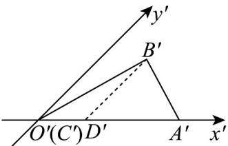

<!-- question-source:start -->
32.（1）如图， $\triangle A'B'C'$ 是水平放置的平面图形的斜二测直观图，将其恢复成原图形；

(2) 在 (1) 中若 $|A'C'| = 2, B'D' // y'$ 轴且 $|B'D'| = 1.5$ , 求原平面图形 $\forall ABC$ 的面积.
<!-- question-source:end -->

![[高中/课堂同步/题库/人教A版高中数学同步讲义(2026)/02_必修第二册/第八章 立体几何初步/专题01 立体图形直观图考点的四大常考题型（高效培优专项训练）/题型四_斜二测求面积/questions/answers/Q00069557A1.md]]
