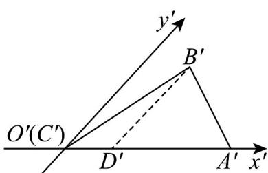
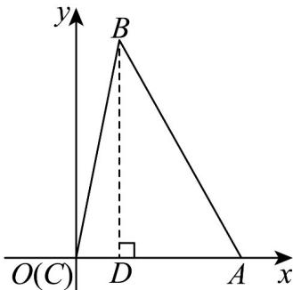
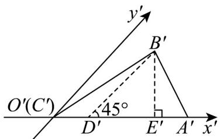

> [!faq]- 《专题01 立体图形直观图考点的四大常考题型》官方解析
>
> > [!success]- **【答案】** (1)图形见解析 (2) $\sqrt{6}$ ， $\sqrt{6}$
>
> > [!note]- **【分析】**
> > （1）利用直观图与原图形的关系作图即可得；
> >
> > (2) 利用直观图的性质计算可得原图形对应边长，即可计算原图形的高与面积.
>
> > [!note]- **【解析】**
> > （1）画出平面直角坐标系 $xOy$ ，在 $x$ 轴上取 $OA = O^{\prime}A^{\prime}$ ，即 $CA = C^{\prime}A^{\prime}$ 在图①中，过 $B'$ 作 $B^{\prime}D^{\prime} / / y^{\prime}$ 轴，交 $x'$ 轴于 $D\Phi$ ，在 $x$ 轴上取 $OD = O^{\prime}D^{\prime}$
> >
> > 过点 D 作 DB//y 轴，并使 $DB = 2D'B'$
> >
> > 连接 $AB$ ， $BC$ ，则 $\forall ABC$ 即为 $\triangle A'B'C'$ 原来的图形，如图②所示：
> >
> > 
> > 图①
> >
> > 
> > 图②
> >
> > (2) 由 (1) 知，原图形中， $BD \perp AC$ 于点 D，则 BD 为原图形中 AC 边上的高，且 $BD = 2B'D'$ ，
> >
> > 在直观图中作 $B^{\prime}E^{\prime}\perp A^{\prime}C^{\prime}$ 于点 $E^{\prime}$ ，
> >
> > 
> >
> > 则 $\triangle A'B'C'$ 的面积 $S_{\triangle A'B'C'} = \frac{1}{2} A'C' \times B'E' = B'E' = \frac{\sqrt{3}}{2}$ ，
> >
> > 在直角三角形 $B^{\prime}E^{\prime}D^{\prime}$ 中， $B^{\prime}D^{\prime} = \sqrt{2} B^{\prime}E^{\prime} = \frac{\sqrt{6}}{2}$ ，所以 $BD = 2B^{\prime}D^{\prime} = \sqrt{6}$ ，
> >
> > 所以 $S_{\triangle ABC} = \frac{1}{2} AC \times BD = \sqrt{6}$
> >
> > 故原图形中 $AC$ 边上的高为 $\sqrt{6}$ ，原图形的面积为 $\sqrt{6}$ 。
