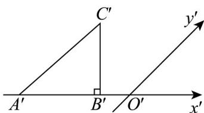
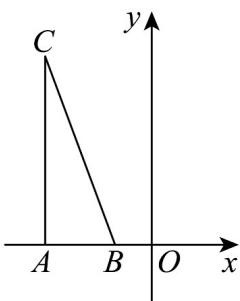

> [!faq]- 《专题01 立体图形直观图考点的四大常考题型》官方解析
>
> > [!success]- **【答案】**  A.2 B.4 C. $2\sqrt{2}$ D. $4\sqrt{2}$
>
> > [!note]- **【分析】**
> > 将直观图还原为原图，如图，求出 $A^{\prime}C^{\prime}$ ，进而求出 $AC$ ，即可求解.
>
> > [!note]- **【解析】**
> > 将直观图还原为原图，如图，
> >
> > 
> >
> > 由 $A'B' = B'C' = 2$ ， $A'B'\perp B'C'$ ，所以 $A^{\prime}C^{\prime} = \sqrt{(A^{\prime}B^{\prime})^{2} + (B^{\prime}C^{\prime})^{2}} = 2\sqrt{2}$
> >
> > 所以 $AC = 2A'C' = 4\sqrt{2}$ ，则 $S_{\triangle ABC} = \frac{1}{2} AB\cdot AC = \frac{1}{2}\cdot 2\cdot 4\sqrt{2} = 4\sqrt{2}$
> >
> > 即 $\vee ABC$ 的面积为 $4\sqrt{2}$
> >
> > 故选 **D**
