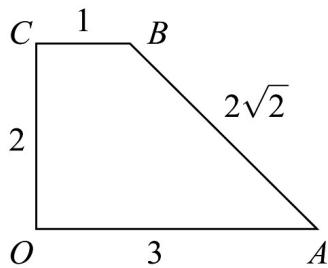

> [!faq]- 《专题01 立体图形直观图考点的四大常考题型》官方解析
>
> > [!success]- **【答案】** (1)作图见解析，4； (2) $\frac{20}{3}\pi$ ， $(8 + 4\sqrt{2})\pi$
>
> > [!note]- **【分析】**
> > （1）根据斜二测画法还原直观图，求出OABC的边长，即可求出四边形OABC的面积.
> >
> > (2) 由 (1) 可知旋转而成的几何体可以看成圆柱加上一个同底的圆锥，求出相关量，再利用锥体、柱体的体积与表面积公式求解.
>
> > [!note]- **【解析】**
> > （1）在直观图中 $O'A'=3$ ， $O'C'=1$ ， $B'C'=1$ ，
> >
> > 则在平面图形中 $OA = 3$ ， $OC = 2O'C' = 2$ ， $BC = B'C' = 1$ ，于是 $AB = \sqrt{2^2 + 2^2} = 2\sqrt{2}$
> >
> > 所以平面四边形 OABC 的平面图形如下图所示：
> >
> > 
> >
> > 由上图可知，平面四边形 $OABC$ 为直角梯形，所以面积为 $\frac{(1 + 3)\times 2}{2} = 4$
> >
> > (2) 直角梯形 $OABC$ 以 $OA$ 为轴，旋转一周而成的几何体可以看成圆柱加上一个同底的圆锥，由（1）可知几何体底面圆半径为 $r = 2$ ，圆柱母线长和高都为1，即 $h_1 = l_1 = 1$ ；圆锥的高为 $h_2 = 2$ ，母线长为 $l_2 = 2\sqrt{2}$ ，所以体积 $V = V_{\text{柱}} + V_{\text{锥}} = \pi r^2 h_1 + \frac{1}{3} \pi r^2 h_2 = 4\pi + \frac{8}{3} \pi = \frac{20}{3} \pi$ ；所以表面积 $S = \pi r^2 + 2\pi rl_1 + \pi rl_2 = 4\pi + 4\pi + 4\sqrt{2}\pi = (8 + 4\sqrt{2})\pi.$
