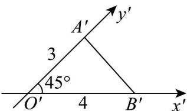
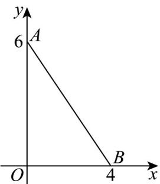

> [!faq]- 《专题01 立体图形直观图考点的四大常考题型》官方解析
>
> > [!success]- **【答案】**  A.6 B. $6\sqrt{2}$ C.12 D.24
>
> > [!note]- **【分析】**
> > 根据斜二测画法画出原图，从而计算出原图的面积.
>
> > [!note]- **【解析】**
> > 根据斜二测画法的知识画出原图如下图所示，
> >
> > 
> >
> > 则原 $\forall AOB$ 的面积为 $\frac{1}{2}$ , 4, 6 = 12.
> >
> > 故选 **C**.
