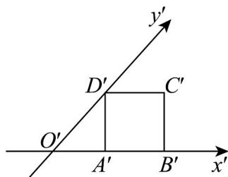
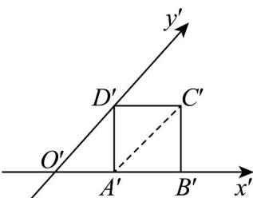
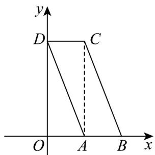

> [!faq]- 《专题01 立体图形直观图考点的四大常考题型》官方解析
>
> > [!success]- **【答案】** 
>
> > [!note]- **【分析】**
> > 画出四边形 ABCD 的原图形，进而求出面积.
>
> > [!note]- **【解析】**
> > 连接 $A^{\prime}C^{\prime}$ ，则 $A^{\prime}C^{\prime}$ 与 $y^\prime$ 平行，且有勾股定理得 $A^{\mathfrak{c}}C^{\mathfrak{c}} = \sqrt{2}$
> >
> > 
> >
> > 故画出四边形ABCD的原图形，如下：
> >
> > 
> >
> > 四边形 $ABCD$ 为平行四边形，高 $AC = 2\sqrt{2}$
> >
> > 故四边形 ABCD 的面积是 $AB \cdot AC = 1 \times 2\sqrt{2} = 2\sqrt{2}$ .
> >
> > 故答案为： $2\sqrt{2}$
