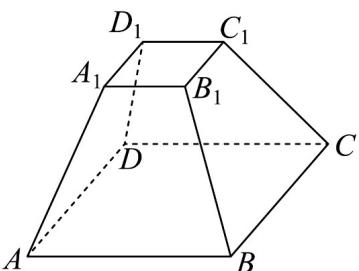
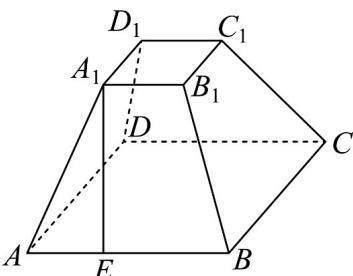

> [!faq]- 《专题02 棱柱、棱锥、棱台表面积与体积的六大常考题型（高效培优专项训练）》官方解析
>
> > [!success]- **【答案】**  A.28 B.26 C.24 D.16
>
> > [!note]- **【分析】**
> > 利用正棱台的结构特征，求出其斜高，再求出表面积.
>
> > [!note]- **【解析】**
> > 在正四棱台 $ABCD - A_{1}B_{1}C_{1}D_{1}$ 的侧面 $ABB_{1}A_{1}$ 中，过点 $A_{1}$ 作 $A_{1}E \perp AB$ ，垂足为 $E$
> >
> > 
> >
> > 则 $A_{1}E = \sqrt{AA_{1}^{2} - AE^{2}} = \sqrt{(\sqrt{5})^{2} - (\frac{3 - 1}{2})^{2}} = 2$
> >
> > 侧面 $ABB_{1}A_{1}$ 的面积 $S_{ABB_1A_1} = \frac{1}{2}\bigl (AB + A_1B_1\bigr)\cdot A_1E = \frac{1}{2}\times (3 + 1)\times 2 = 4$
> >
> > 所以正四棱台 $ABCD - A_{1}B_{1}C_{1}D_{1}$ 的表面积 $S = 4 \times 4 + 1^{2} + 3^{2} = 26$
> >
> > 故选 **B**
