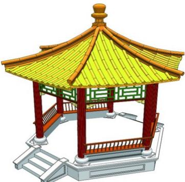
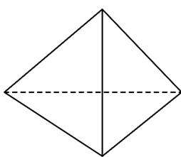

> [!faq]- 《专题02 棱柱、棱锥、棱台表面积与体积的六大常考题型（高效培优专项训练）》官方解析
>
> > [!success]- **【答案】** 
>
> > [!note]- **【分析】**
> > 设底面边长为 $a$ ，根据侧棱长和高求出 $a = 1$ ，进而求出棱锥的斜高，最后求出侧面积即可.
>
> > [!note]- **【解析】**
> > 设正六棱锥底面边长为 $a$ ，则由正六边形的性质可知底面中心到底面顶点的距离为 $a$
> >
> > 又正六棱锥高为 $1$ 且侧棱长为 $\sqrt{2}$ ，根据正六棱锥的性质得 $\sqrt{2} = \sqrt{a^2 + 1^2}$ ，解得 $a = 1$ ，所以侧面等腰三角形的高 $h = \sqrt{\left(\sqrt{2}\right)^2 - \left(\frac{1}{2}\right)^2} = \frac{\sqrt{7}}{2}$ 所以棱锥侧面积为 $S = 6 \times \frac{1}{2} \times ah = 6 \times \frac{1}{2} \times 1 \times \frac{\sqrt{7}}{2} = \frac{3\sqrt{7}}{2}$ . 故答案为： $\frac{3\sqrt{7}}{2}$
> >
> > 10. 一正三棱锥侧面三角形的顶角为 $90^{\circ}$ , 则该三棱锥的侧面积与底面积之比为 ( )
> >
> > 【答案】
> >
> > A. $\sqrt{3}$ B. 2    C. $\sqrt{6}$ D. 3
> >
> > 【答案】A
> >
> > 【分析】由正三棱锥侧面三角形的顶角为 $90^{\circ}$ ，可知侧面三角形为等腰直角三角形，进而可得到侧棱长与底面边长的关系，进一步可得答案.
> >
> > 【详解】由正三棱锥知：所有侧棱长相等且底面为等边三角形.
> >
> > 由侧面三角形顶角为 $90^{\circ}$ ，可得侧面三角形为等腰直角三角形，
> >
> > 设侧棱长为 $L$ ，底面边长为 $l$ ，在侧面三角形中，可得 $l = \sqrt{2} L$ ，
> >
> > 侧面积为 $S_{1} = 3 \cdot \frac{1}{2} L^{2} = \frac{3}{2} L^{2}$ ，底面积为 $S_{2} = \frac{\sqrt{3}}{4} l^{2} = \frac{\sqrt{3}}{2} L^{2}$ ,
> >
> > 所以 $\frac{S_{1}}{S_{2}} = \frac{\frac{3}{2} L^{2}}{\frac{\sqrt{3}}{2} L^{2}} = \sqrt{3}$ .
> >
> > 故选：A
> >
> > 
