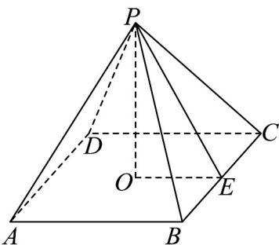

> [!faq]- 《专题02 棱柱、棱锥、棱台表面积与体积的六大常考题型（高效培优专项训练）》官方解析
>
> > [!success]- **【答案】** A
>
> > [!note]- **【分析】**
> > 求得斜高，结合表面积公式求解即可.
>
> > [!note]- **【解析】**
> > 如图， $PO$ 是正四棱锥的高，所以 $PO = \sqrt{3}$
> >
> > $PE$ 是斜高，由 $S_{\text{侧}} = 2S_{\text{底}}$ 可得 $4 \cdot \frac{1}{2} \cdot BC \cdot PE = 2BC^2$
> >
> > 
> >
> > 所以 BC = PE ，在 Rt△POE 中， $PO = \sqrt{3}$
> >
> > $OE = \frac{1}{2} BC = \frac{1}{2} PE$ ，所以 $3 + \left(\frac{PE}{2}\right)^2 = PE^2$ ，所以 $PE = 2$
> >
> > 所以 $S_{底} = BC^{2} = PE^{2} = 4, S_{侧} = 2S_{底} = 2 \times 4 = 8$
> >
> > 所以 $S_{\text{表}} = S_{\text{底}} + S_{\text{侧}} = 4 + 8 = 12$
> >
> > 故选 **A**.
