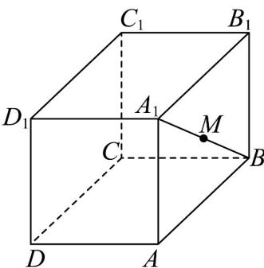
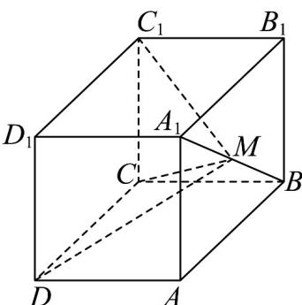
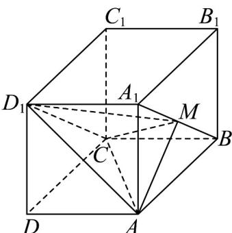
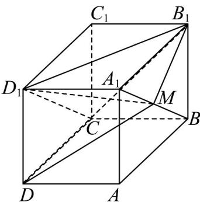
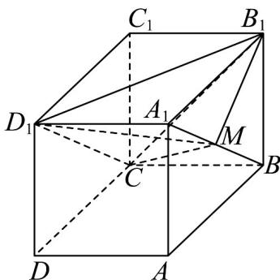

> [!faq]- 《专题02 棱柱、棱锥、棱台表面积与体积的六大常考题型（高效培优专项训练）》官方解析
>
> > [!success]- **【答案】** A. $\frac{\sqrt{3}\pi}{3}$ B. $2\sqrt{2}\pi$ C. $\frac{2\sqrt{2}\pi}{3}$ D. $\sqrt{3}\pi$
>
> > [!note]- **【分析】**
> > 求出扇形的弧长，进而求出圆锥的底面半径，由勾股定理得到圆锥的高，利用圆锥体积公式求解即可.
>
> > [!note]- **【解析】**
> > 因为圆锥的侧面展开图是半径为 3，圆心角为 $\frac{2\pi}{3}$ 的扇形，
> >
> > 所以该扇形的弧长为 $\frac{2\pi}{3} \times 3 = 2\pi$
> >
> > 设圆锥的底面半径为 $r$ ，则 $2\pi r = 2\pi$ ，解得： $r = 1$
> >
> > 因为圆锥的母线长为3，所以圆锥的高为 $h = \sqrt{3^2 - 1^2} = 2\sqrt{2}$
> >
> > 该圆锥的体积为 $\frac{1}{3}\pi r^2 h = \frac{1}{3}\pi \times 1^2\times 2\sqrt{2} = \frac{2\sqrt{2}}{3}\pi .$
> >
> > 故选：C
> >
> > 36. 平行六面体 $ABCD - A_{1}B_{1}C_{1}D_{1}$ 的体积为 $V$ ，点 $M$ 在线段 $BA_{1}$ 上运动，则下列三棱锥中，体积为 $\frac{1}{6} V$ 的是（）
> >
> > 【答案】
> >
> > 
> >
> > A.三棱锥 $C_1 - MCD$ B.三棱锥 $C - D_{1}MA$ C.三棱锥 $D_{1} - DMB_{1}$ D.三棱锥 $C - D_{1}MB_{1}$
> >
> > 【答案】ABD
> >
> > 【分析】确定各三棱锥的底面，与六面体的高和底面进行比较，必要时使用等体积法.
> > 【详解】
> >
> > 
> >
> > 对于三棱锥 $C_1 - MCD$ .因平面 $AA_{1}B_{1}B //$ 平面 $DD_{1}C_{1}C$ ，且 $A_{1}B\subset$ 平面 $AA_{1}B_{1}B$
> >
> > 所以 $A_{1}B \parallel$ 平面 $C_{1}CD$ . 故在 $A_{1}B$ 上运动的 M 点距离平面 $C_{1}CD$ 的距离为定值，
> >
> > 等于两平面间的距离.因此三棱锥以 $\Delta C_{1}CD$ 为底，六面体以平行四边形 $DD_{1}C_{1}C$ 为底，
> >
> > 则三棱锥的底面积为六面体的 $\frac{1}{2}$ ，高与六面体的高相等，
> >
> > 故体积为 $\frac{1}{2} V\cdot \frac{1}{3} = \frac{1}{6} V$ .选项A正确.
> >
> > 
> >
> > 对于三棱锥 $C - D_{1}MA$ 由平行六面体的性质得 $CD_{1} / / BA_{1}$ ，且 $CD_{1} \subset$ 平面 $CD_{1}A$
> >
> > 故 $A_{1}B \parallel$ 平面 $CD_{1}A$ . 故在 $A_{1}B$ 上运动的 M 点距离平面 $CD_{1}A$ 的距离为定值.
> >
> > 不妨让 M 与 B 点重合，三棱锥 $C - D_{1}MA$ 以 $\triangle CD_{1}A$ 为底，
> >
> > 其体积与三棱锥 $B-CD_{1}A$ 的体积相等. 对于三棱锥 $B-CD_{1}A$
> >
> > 以VABC为底，六面体以平行四边形ABCD为底，
> >
> > 则三棱锥的底面积为六面体的底面积的一半，高相等，故体积为 $\frac{1}{2} V\cdot \frac{1}{3} = \frac{1}{6} V$ 选项B正确
> >
> > 
> >
> > 对于三棱锥 $D_{1}-DMB_{1}$ . 直线 $CD_{1}$ 与平面 $DD_{1}B$ 相交于 $D_{1}$
> >
> > 故 $A_{1}B$ 与平面 $DD_{1}B_{1}$ 不平行.三棱锥以 $\triangle DD_{1}B_{1}$ 为底，
> >
> > 动点 M 距离底面的距离随 M 点运动而变化，故该三棱锥的体积并非定值。选项 C 错误。
> >
> > 
> >
> > 对于三棱锥 $C-D_{1}MB_{1}$ . 因 $CD_{1}$ 在平面 $CD_{1}B_{1}$ 内，故 $A_{1}B \parallel$ 平面 $B_{1}D_{1}C$
> >
> > 所以无论 M 运动到何处，其到平面 $B_{1}D_{1}C$ 的距离为定值。不妨设 M 与 B 点重合，三棱锥 $C - D_{1}MB_{1}$ 的体积即与三棱锥 $D_{1} - CBB_{1}$ 的体积相等.该三棱锥以 $\triangle CBB_{1}$ 为底，六面体以平行四边形 $CBB_{1}C_{1}$ 为底，则该三棱锥的底面积为六面体的一半，高与六面体的高相等，故体积为 $\frac{1}{2} V\cdot \frac{1}{3} = \frac{1}{6} V$ .选项D正确
> >
> > 故选 **ABD**
