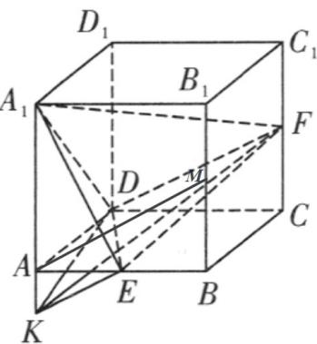

> [!faq]- 《专题02 棱柱、棱锥、棱台表面积与体积的六大常考题型（高效培优专项训练）》官方解析
>
> > [!success]- **【答案】** A
>
> > [!note]- **【分析】**
> > 延长 $A_{1}A$ 到 $K$ ，使 $AK = \frac{1}{4}$ ，易得 $KE / / DF$ ，再利用体积转化 $V_{A_1 - DEF} = V_{E - A_1DF} = V_{K - A_1DF} = V_{F - A_1DK}$ 即可求解.
>
> > [!note]- **【解析】**
> > 如图，延长 $A_{1}A$ 到 $K$ ，使 $AK = \frac{1}{4}$ ，连接 $KE, KD, KF$
> >
> > 设 $BB_{1}$ 中点为 $M$ ，易得 $AM\parallel DF$ ，又 $AK = \frac{1}{4}$ ， $E$ 为 $AB$ 中点，
> >
> > $$
> > K E \parallel A M
> > $$
> >
> > $$
> > K E \parallel D F
> > $$
> >
> > $DF \subset$ 平面 $A_{1}DF$ , $KE$ 不在平面 $A_{1}DF$ 内, 所以 $KE //$ 平面 $A_{1}DF$ , 所以 $V_{A_{1}-DEF} = V_{E-A_{1}DF} = V_{K-A_{1}DF} = V_{F-A_{1}DK} = \frac{1}{3} S_{\triangle A_{1}DK} \cdot CD$ ,
> >
> > 因为 $S_{\triangle A_1DK} = \frac{1}{2} A_1K\cdot AD = \frac{5}{8}$ ，所以 $V_{A_1 - DEF} = \frac{5}{24}$
> >
> > 
> >
> > 故答案为：A.
