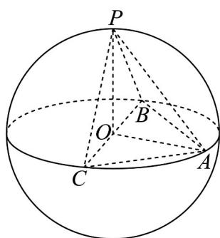

> [!faq]- 《专题02 棱柱、棱锥、棱台表面积与体积的六大常考题型（高效培优专项训练）》官方解析
>
> > [!success]- **【答案】** B
>
> > [!note]- **【分析】**
> > 证明VABC是等腰直角三角形，求出BC,AO,PO的长，即可求出三棱锥P-ABC体积的最大值.
>
> > [!note]- **【解析】**
> > 由题意，
> > ∵球O的半径为1，且BC=2，
> > ∴A,B,C三点所在的平面经过球心，BC为球的一条直径.
> > ∵AB=AC，
> > ∴VABC是等腰直角三角形，
> >
> > 如图，
> >
> > 
> >
> > 由几何知识得，当点 P 位于垂直于平面 ABC 的直径的端点时，三棱锥 P-ABC 的体积取得最大值，
> > 此时 BO = CO = AO = PO = $\frac{1}{2}$ BC = 1,
> >
> > ∴最大值为 $V=\frac{1}{3}S_{\triangle ABC}\cdot OP=\frac{1}{3}\cdot\frac{1}{2}BC\cdot AO\cdot OP=\frac{1}{3}\times\frac{1}{2}\times2\times1\times1=\frac{1}{3}$
> >
> > 故选 **B**.
