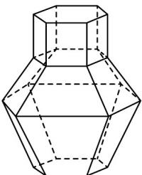

> [!faq]- 《专题02 棱柱、棱锥、棱台表面积与体积的六大常考题型（高效培优专项训练）》官方解析
>
> > [!success]- **【答案】**  A. 2:6:15 B. 9:15:25 C. 6:21:35 D. 9:21:56
>
> > [!note]- **【分析】**
> > 利用柱体、台体体积公式可求得结果.
>
> > [!note]- **【解析】**
> > 设直棱柱I的底面积为S，高为2h，则棱台II的上底面面积为S，下底面面积为4S，高为3h，
> > 棱台III的上底面面积为4S，下底面面积为S，高为5h，
> > 设几何体I、II、III的体积分别为 $V_{1}$ 、 $V_{2}$ 、 $V_{3}$ ，
> > 则 $V_{1}=S\cdot2h=2Sh$ ， $V_{2}=\frac{1}{3}(S+4S+\sqrt{S\cdot4S})\cdot3h=7Sh$ ， $V_{3}=\frac{1}{3}(4S+S+\sqrt{4S\cdot S})\cdot5h=\frac{35}{3}Sh$ 因此， $V_{1}:V_{2}:V_{3}=2:7:\frac{35}{3}=6:21:35$
> >
> > 故选 **C**.
