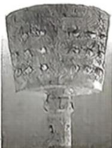
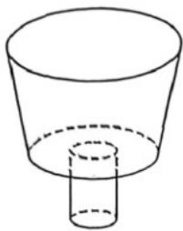

> [!faq]- 《专题02 棱柱、棱锥、棱台表面积与体积的六大常考题型（高效培优专项训练）》官方解析
>
> > [!success]- **【答案】** A
>
> > [!note]- **【分析】**
> > 设出圆锥和圆柱的高和底面半径，然后根据体积比可求出高之比。
>
> > [!note]- **【解析】**
> > 设圆柱和圆锥的高分别为 $h_{1}, h_{2}$ ，底面半径分别为 $r_{1}, r_{2}$ ，
> > 因为圆柱和圆锥的体积之比为 $\frac{3}{4}$ ，则 $\frac{\pi r_{1}^{2}h_{1}}{3\pi r_{2}^{2}h_{2}}=\frac{3}{4}$ ，所以 $\frac{h_{1}}{h_{2}}=\frac{r_{2}^{2}}{4r_{1}^{2}}=\frac{1}{16}$ ，
> >
> > 故选：A.
> >
> > 26. 图 1 是名为“大铙”的西周云纹青铜乐器，其高 76.8 厘米，重 100.35 千克。某同学为估算“大铙”的体积，设计了一个与之等高等口径的组合体（如图 2）。该组合体由一个圆台和一个圆柱构成，已知圆台与圆柱的高之比为 3:2，圆台的上、下底面和圆柱的底面半径之比为 4:3:1。则圆台和圆柱的体积之比约为（）
> >
> > 【答案】
> >
> > 
> > 图1
> >
> > 
> > 图2
> >
> > A. 12:1 B. 18:1 C. 16:1 D. 37:2
> >
> > 【答案】D
> >
> > 【分析】设圆柱的底面半径为 r，高为 2h，代入体积公式，可得圆柱的体积，由题意，圆台的下底面半径为 3r，上底面半径为 4r，高为 3h，代入公式，可得圆台的体积，即可得答案.
> >
> > 【详解】设圆柱的底面半径为 $r$ ，高为 $2h$ ，则圆柱的体积为 $\pi r^2\cdot 2h = 2\pi r^2 h$
> >
> > 由题意，圆台的下底面半径为 $3r$ ，上底面半径为 $4r$ ，高为 $3h$
> >
> > 所以圆台的体积为 $\frac{1}{3}\left[\pi(3r)^2 + \sqrt{\pi(3r)^2 \cdot \pi(4r)^2} + \pi(4r)^2\right] \cdot 3h = 37\pi r^2h$
> >
> > 所以圆台和圆柱的体积之比约为 37:2.
> >
> > 故选D.
> >
> > 27. 一水壶如图所示可视为由圆台和圆柱组成，圆台上底面半径为 $1\mathrm{cm}$ ，下底面半径为 $3\mathrm{cm}$ ，圆台高 $2\mathrm{cm}$ ，圆柱高 $12\mathrm{cm}$ ，若装满水，则水壶容量约为 \_\_\_\_ mL。（忽略底部和瓶盖部分，取 $\pi \approx 3$ ）
> >
> > 
> >
> > 【答案】350
> >
> > 【分析】分别利用圆台的体积公式和圆柱的体积公式求出圆台和圆柱的体积，再把两个的体积相加就是水壶容量.
> >
> > 【详解】由题可知圆台的体积为 $\frac{1}{3} \times 2 \times \left(3 \times 1^2 + 3 \times 3^2 + \sqrt{3 \times 1^2 \times 3 \times 3^2}\right) = 26$
> >
> > 圆柱的体积为 $3 \times 3^{2} \times 12 = 324$ ，所以水壶容量约为 $26 + 324 = 350$ ；
> >
> > 故答案为：350
